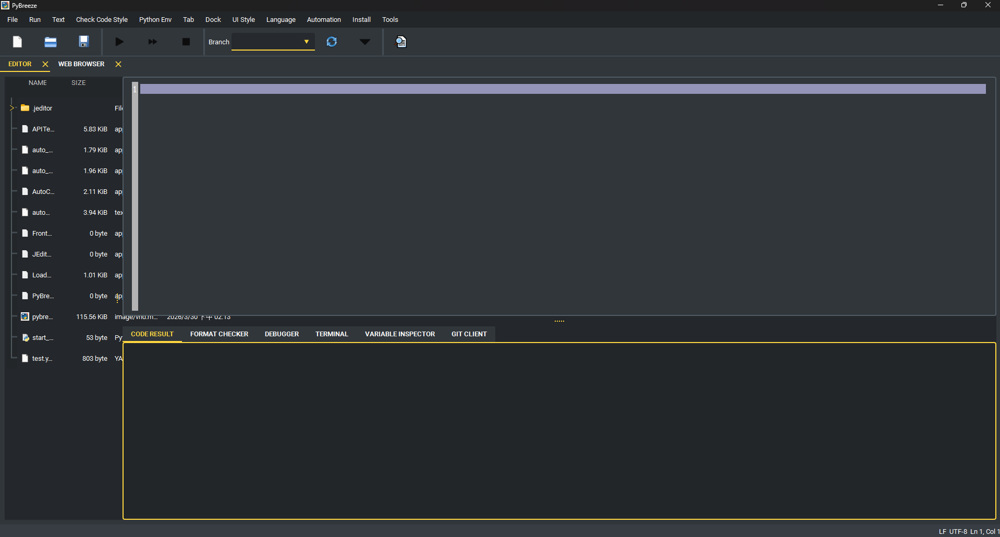
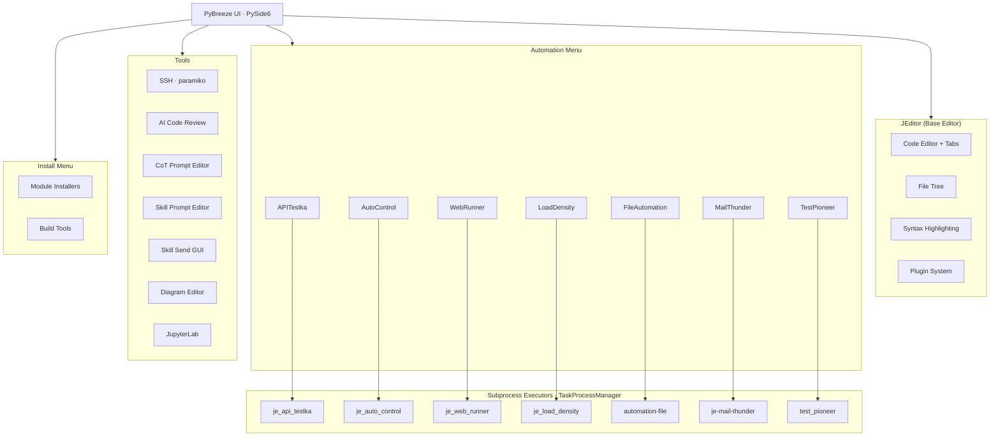

# PyBreeze: The Automation-First IDE

[](https://www.python.org/downloads/)
[](LICENSE)
[](https://doc.qt.io/qtforpython/)
[](https://pybreeze.readthedocs.io/en/latest/index.html)

[繁體中文](README/README_zh-TW.md) | [简体中文](README/README_zh-CN.md)



**PyBreeze** is a Python IDE purpose-built for automation engineers. It integrates Web, API, GUI, and load testing automation into a single unified environment — no plugin hunting, no complex environment setup, just open and start automating.

---

## Table of Contents

- [Features](#features)
  - [Four-Dimensional Automation](#four-dimensional-automation)
  - [IDE Core Capabilities](#ide-core-capabilities)
  - [Built-in Tools](#built-in-tools)
  - [AI-Assisted Development](#ai-assisted-development)
  - [Plugin System](#plugin-system)
  - [Multi-Language UI](#multi-language-ui)
- [Architecture](#architecture)
- [Installation](#installation)
- [Quick Start](#quick-start)
- [Integrated Automation Modules](#integrated-automation-modules)
- [Project Structure](#project-structure)
- [Dependencies](#dependencies)
- [Target Audience](#target-audience)
- [License](#license)

---

## Features

### Four-Dimensional Automation

PyBreeze covers the full spectrum of automation testing needs out of the box:

| Dimension | Module | Description |
|---|---|---|
| **Web Automation** | [WebRunner](https://github.com/Intergration-Automation-Testing/WebRunner) | Browser-based interaction simulation and testing with deep integration of browser drivers and element locators |
| **API Automation** | [APITestka](https://github.com/Intergration-Automation-Testing/APITestka) | RESTful API development and testing with built-in request builders, response analyzers, mock servers, and assertion verification |
| **GUI Automation** | [AutoControl](https://github.com/Intergration-Automation-Testing/AutoControl) | Desktop application automation via image recognition, coordinate-based positioning, keyboard/mouse control, and action recording |
| **Load & Stress Testing** | [LoadDensity](https://github.com/Intergration-Automation-Testing/LoadDensity) | High-concurrency performance testing engine for monitoring system stability under extreme pressure |

Additionally:

- **File Automation** — Automated file and directory operations via the [automation-file](https://github.com/Intergration-Automation-Testing/AutomationFile) module
- **Mail Automation** — Automated email sending (e.g., test report delivery) via [MailThunder](https://github.com/Intergration-Automation-Testing/MailThunder)
- **Test Framework** — Structured YAML-driven test execution via [TestPioneer](https://github.com/Intergration-Automation-Testing/TestPioneer)

### IDE Core Capabilities

PyBreeze is not just a code editor — it is a command center for the automation lifecycle:

- **Syntax Highlighting** — Built-in Python syntax highlighting with deep keyword awareness for automation libraries (APITestka, AutoControl, WebRunner, LoadDensity, etc.). Custom syntax rules can be added via plugins.
- **Code Editor** — Built on [JEditor](https://github.com/Intergration-Automation-Testing/JEditor), a full-featured editor with tab management, file tree navigation, and project workspace support.
- **Script Execution** — Run automation scripts directly from the IDE with real-time output. Supports single-script and multi-script batch execution.
- **Report Generation** — Automation modules can generate HTML, JSON, and XML reports after test execution, with optional email delivery.
- **Integrated JupyterLab** — Launch JupyterLab directly as a tab within PyBreeze for interactive notebook-based development. Auto-installs JupyterLab if not present.
- **Virtual Environment Awareness** — Automatically detects and uses the project's virtual environment (`.venv` or `venv`).

### Built-in Tools

- **SSH Client** — Full SSH terminal client with:
  - Password and private key authentication
  - Interactive command execution
  - Remote file tree viewer with CRUD operations (create folder, rename, delete, upload, download)
  - Interactive TOFU host-key verification with confirmed keys persisted to `~/.pybreeze/ssh_known_hosts`
- **Diagram Editor** — Built-in WYSIWYG architecture-diagram editor:
  - Rectangle, rounded rectangle, ellipse, diamond nodes, connection lines, and free text
  - Image insertion from local files or URLs (URL fetches are SSRF-validated and size-capped)
  - Mermaid `flowchart` / `graph` import
  - Save/Open as `.diagram.json`, export to PNG or SVG
  - Undo/redo, align, distribute, grid, snap, and zoom controls
- **cURL Import** — Paste a `curl` command copied from your browser's dev tools and generate a ready-to-run script for the target of your choice: **Python `requests`**, an **APITestka Python** snippet (`test_api_method_requests(...)`), an **APITestka JSON action** (`[["AT_test_api_method", {...}]]`) that `execute_files` runs directly, or a **LoadDensity** Locust load-test (`start_test(...)`). (These are the HTTP-oriented modules; a curl request has no meaningful mapping to the browser or desktop-GUI automation modules.) Parses the method, URL, headers, body, basic auth, `-G` query parameters, `-F` multipart form fields (file uploads become `files=open(...)`), the `--json` shortcut (which also sets the JSON `Content-Type`/`Accept`), and `-d @file` bodies (which become `open(...).read()`, while `--data-raw` stays literal) — all with multi-line `\` / `^` continuations. It knows the arity of curl's common flags, so value-taking options like `--max-time 30` or `-o out.json` never leak into the URL; it URL-encodes `--data-urlencode` values the way curl does; and it infers `POST` when a body or form is present and sends JSON bodies as JSON. Targets include Python `requests`, a ready-to-run **pytest test** (a named `test_...` function that sends the request and asserts the status), APITestka (Python and JSON action), and a LoadDensity load test. Pick one from the dropdown, then copy the result, **open it straight into a new editor tab**, or **save it to a `.py` / `.json` file** (the extension follows the chosen target). A repeated `-H` is handled the way HTTP handles it — the values are combined into one header (with `; ` for cookies) rather than the last one silently winning, and names are matched case-insensitively so an explicit header always beats one implied by another flag. One click also hands the parsed parts to the tool that specialises in them: the **URL to the URL parser/builder** (query string and all) or the **headers to the header analyzer**. The parser is pure logic and never executes the command.
- **HAR Import** — "Copy as cURL" captures one request; **Save all as HAR** captures the session. Open that `.har` export and every recorded call is listed with its method, path, status and media type — page furniture (stylesheets, images, fonts) filtered out by default so what remains is the API traffic. Select the calls you want, or take everything listed, and generate one script for the whole set using the same targets as the cURL importer: a **pytest file** with one test per call (repeated endpoints get numbered names so no test silently replaces another), an **APITestka action list** that replays the flow in capture order, a **`requests` walkthrough**, an APITestka Python script, or LoadDensity runs. Recorded headers, cookies, query parameters and bodies (raw, URL-encoded and multipart, including file uploads) all come across; HTTP/2 pseudo-headers are dropped and a `Cookie` header that duplicates the recorded cookie list is removed, so the generated code sends each value once. A single selected request produces exactly what the cURL importer would, so the two tools never disagree. HAR is JSON, so this needs nothing beyond the standard library, and nothing is ever replayed for you.
- **JWT Decoder** — Paste a JSON Web Token and read its header and payload as pretty-printed JSON, with standard timestamp claims (`exp`, `iat`, `nbf`, `auth_time`) rendered as readable UTC times. Inspection only — the signature is never verified and the token is never trusted.
- **Timestamp Converter** — Enter a Unix epoch value (seconds or milliseconds, auto-detected) or an ISO-8601 date-time (with `Z` or an offset) and get every representation back in UTC. Deterministic and independent of the local time zone.
- **Hash Generator** — Compute SHA-256, SHA-512, SHA-1 and MD5 digests of any text at once. A general-purpose checksum tool (MD5/SHA-1 are provided for interoperability with `usedforsecurity=False`, never for security decisions).
- **Query ⇄ JSON** — Convert an `application/x-www-form-urlencoded` query string to pretty JSON and back, URL-decoding and -encoding as needed. Repeated keys become JSON arrays and vice versa. Copy the result, open it in an editor tab, or save it to a file.
- **URL Parser / Builder** — Paste a URL to see its scheme, host, port, path, query, fragment and credentials as an editable JSON object, tweak any part, and turn it back into a URL. Round-trips both ways, brackets IPv6 literals, and re-encodes query parameters for you. The cURL importer can send a request's URL straight here.
- **HTTP Header Analyzer** — Paste a request or response header block (from dev tools, `curl -i`, or a proxy log) and read back every field plus what is worth knowing about it: names sent more than once, `Set-Cookie` entries missing `Secure` / `HttpOnly` / `SameSite`, a wildcard CORS policy (and the wildcard-plus-credentials combination browsers reject outright), an HSTS `max-age` too short to survive a restart, CSP `unsafe-inline` / `unsafe-eval`, product banners, deprecated headers, and — for responses — the security headers that are absent. Headers carrying credentials are reported by name only; their values are never copied into the report. The cURL importer and the Response Inspector both hand their headers here in one click, and a bearer token spotted in any header opens in the JWT decoder, already decoded.
- **Regex Tester** — Try a regular expression against sample text with `IGNORECASE` / `MULTILINE` / `DOTALL` / `VERBOSE` flags, and see every match with its offsets, numbered groups and named groups. Invalid patterns report a friendly error instead of crashing.
- **HTTP Status Reference** — Search the full HTTP status code table (sourced from the standard library, so it stays current) by code prefix or keyword, with the reason phrase, description and status class for each.
- **Text Diff** — Compare two pieces of text (for example an expected vs. actual API response) side by side and get a unified diff plus a one-line summary of how many lines were added or removed. Copy the diff, open it in an editor tab, or save it to a file.
- **JSON Format** — Pretty-print or minify a JSON payload, with a clear validation error when the input is not valid JSON. Copy the result, open it in a new editor tab, or save it to a file.
- **Response Inspector** — Paste a raw HTTP response and get a decoded summary in one step: the status code is looked up in the HTTP reference, headers are parsed, a JSON body is pretty-printed, and any JWTs anywhere in the text (for example an `Authorization: Bearer` header) are decoded with their timestamp claims shown in UTC. Ties the HTTP-status, JSON-format and JWT tools together, and can open a found status code, JWT, the whole header block, or a JSON body directly in its dedicated tool tab, pre-filled.
- **File Tree Context Menu** — Right-click any file or folder in the project tree to create files/folders, rename, delete, copy absolute or relative paths, or reveal the item in your platform file manager. Renaming or deleting a file that is currently open in an editor tab keeps the tab in sync.
- **Package Manager** — Install automation modules and build tools directly from the IDE menu without leaving the editor.
- **Integrated Documentation** — Quick access to documentation and GitHub pages for each automation module directly from the menu bar.

### AI-Assisted Development

- **AI Code Review** — Send code to an LLM API endpoint for automated code review. Accept or reject suggestions directly in the IDE.
- **Chain-of-Thought Code Review (prthinker)** — Run the [prthinker](https://github.com/JE-Chen/Code-Review-Framework-Combining-Large-Language-Models-and-Chain-of-Thought-Reasoning) review pipeline over the file being edited, or over a Pull Request, with its output streaming into a run window. One settings form holds the inference backend (a review server, an OpenAI-compatible endpoint, Anthropic, or a local model), the code host and the repository. Keys and tokens are handed to the review as environment, never on a command line where a process list would show them.
- **CoT (Chain-of-Thought) Prompt Editor** — Create and manage multi-step CoT prompts for structured code analysis, including:
  - Code review prompts
  - Code smell detection
  - Linting analysis
  - Step-by-step analysis
  - Summary generation
- **Skill Prompt Editor** — Define and manage reusable skill-based prompts (code explanation, code review templates) that can be sent to LLM APIs.
- **Skill Send GUI** — Pick a skill prompt template, optionally edit the prompt text, send it to an LLM API endpoint, and view the response — all in a dedicated tab or dock.

### Plugin System

PyBreeze supports an extensible plugin architecture for:

- **Syntax Highlighting** — Add syntax highlighting for any programming language via plugins
- **UI Translation** — Add new interface languages via translation plugins
- **Run Configurations** — Add "Run with..." support for compiled and interpreted languages (C, C++, Go, Java, Rust, etc.)
- **Plugin Browser** — Browse and install plugins from remote repositories directly within the IDE

Plugins are auto-discovered from the `jeditor_plugins/` directory. See [PLUGIN_GUIDE.md](PLUGIN_GUIDE.md) for full documentation.

**Bundled plugins:** C, C++, Go, Java, Rust syntax highlighting and run support; French translation.

### Multi-Language UI

The IDE interface supports multiple languages:

- **English** (default)
- **Traditional Chinese** (繁體中文)
- Additional languages can be added via plugins

---

## Architecture



PyBreeze follows a modular architecture:

```
PyBreeze UI (PySide6)
├── JEditor (Base Editor Engine)
│   ├── Code Editor with Tabs
│   ├── File Tree Navigation
│   ├── Syntax Highlighting Engine
│   └── Plugin System
├── Automation Menu
│   ├── APITestka ──→ APITestka Executor ──→ je_api_testka
│   ├── AutoControl ──→ AutoControl Executor ──→ je_auto_control
│   ├── WebRunner ──→ WebRunner Executor ──→ je_web_runner
│   ├── LoadDensity ──→ LoadDensity Executor ──→ je_load_density
│   ├── FileAutomation ──→ FileAutomation Executor ──→ automation-file
│   ├── MailThunder ──→ MailThunder Executor ──→ je-mail-thunder
│   └── TestPioneer ──→ TestPioneer Executor ──→ test_pioneer
├── Tools
│   ├── SSH Client (paramiko)
│   ├── AI Code Review Client
│   ├── CoT Prompt Editor
│   ├── Skill Prompt Editor
│   ├── Skill Send GUI
│   ├── Diagram Editor (WYSIWYG, Mermaid import, PNG/SVG export)
│   ├── cURL Import (curl → Python requests code)
│   ├── HAR Import (browser session → test suite)
│   ├── JWT Decoder (header/payload inspection)
│   ├── Timestamp Converter (epoch ⇄ ISO-8601)
│   ├── Hash Generator (SHA-256/512, SHA-1, MD5)
│   ├── Query ⇄ JSON Converter
│   ├── URL Parser / Builder (URL ⇄ JSON parts)
│   ├── HTTP Header Analyzer (duplicates, cookie flags, security headers)
│   ├── Regex Tester
│   ├── HTTP Status Reference
│   ├── Text Diff
│   ├── JSON Format (pretty / minify)
│   ├── Response Inspector (status + JSON + JWT)
│   └── JupyterLab Integration
└── Install Menu
    ├── Automation Module Installers
    └── Build Tools Installer
```

Each automation module runs in its own subprocess via `PythonTaskProcessManager`, providing process isolation and preventing crashes from affecting the IDE.

---

## Installation

### From PyPI

```bash
pip install pybreeze
```

### From Source

```bash
git clone https://github.com/Intergration-Automation-Testing/AutomationEditor.git
cd AutomationEditor
pip install -r requirements.txt
```

### System Requirements

- **Python**: 3.10 or higher
- **OS**: Windows, macOS, Linux
- **GUI Framework**: PySide6 6.11.0 (installed automatically)

---

## Quick Start

### Run via command line

```bash
python -m pybreeze
```

### Run via Python script

```python
from pybreeze import start_editor

start_editor()
```

### Run from the exe directory

```bash
python exe/start_pybreeze.py
```

Once launched, you can:

1. **Write automation scripts** in the editor with syntax-aware auto-completion
2. **Execute scripts** via `Automation` menu — choose the target module (APITestka, WebRunner, etc.)
3. **View results** in the integrated output panel
4. **Generate reports** in HTML/JSON/XML formats
5. **Send reports** via email using MailThunder integration

---

## Integrated Automation Modules

### APITestka — API Testing

- HTTP method testing (GET, POST, PUT, DELETE, etc.)
- Async HTTP support via httpx
- Mock server creation with Flask
- Report generation (HTML, JSON, XML)
- Scheduler-based event triggering
- Socket server support

### AutoControl — GUI Automation

- Mouse control (click, drag, scroll, position tracking)
- Keyboard simulation (type, hotkey, key press/release)
- Image recognition and locate-and-click
- Screenshot capture
- Action recording and playback
- Shell command execution
- Process management

### WebRunner — Web Automation

- Browser driver integration
- Element location and interaction
- Web-based test scripting
- Report generation

### LoadDensity — Load Testing

- Concurrent request simulation
- Performance metrics collection
- Stress test scenario management
- Report generation

### MailThunder — Email Automation

- SMTP email sending
- HTML report delivery
- Attachment support
- Environment variable-based configuration

### TestPioneer — Test Framework

- YAML-based test definition
- Template generation
- Structured test execution

### File Automation

- Automated file and directory operations
- Batch file processing

### prthinker — Chain-of-Thought Code Review

- Review the file being edited, or a Pull Request on GitHub / GitLab / Gitea
- Inference backends: a review server, an OpenAI-compatible endpoint, Anthropic, or a local model
- Settings are kept per user in `~/.pybreeze/prthinker_setting.json`; keys travel to the review as environment
- Installed from its own source folder (`Install ▸ Automation ▸ Install prthinker`), which needs Python 3.12 or newer

---

## Project Structure

```
PyBreeze/
├── pybreeze/
│   ├── __init__.py                 # Public API (start_editor, plugin re-exports)
│   ├── __main__.py                 # Entry point (python -m pybreeze)
│   ├── extend/
│   │   ├── mail_thunder_extend/    # Email report sending after tests
│   │   ├── process_executor/       # Subprocess managers for each automation module
│   │   │   ├── api_testka/
│   │   │   ├── auto_control/
│   │   │   ├── file_automation/
│   │   │   ├── load_density/
│   │   │   ├── mail_thunder/
│   │   │   ├── test_pioneer/
│   │   │   └── web_runner/
│   │   └── process_executor/python_task_process_manager.py
│   ├── extend_multi_language/      # Built-in translations (English, Traditional Chinese)
│   ├── pybreeze_ui/
│   │   ├── editor_main/            # Main window (extends JEditor) + file tree context menu
│   │   ├── connect_gui/ssh/        # SSH client widgets (TOFU host-key verification)
│   │   ├── diagram_editor/         # WYSIWYG architecture-diagram editor
│   │   ├── extend_ai_gui/          # AI code review & prompt editors
│   │   ├── jupyter_lab_gui/        # JupyterLab integration
│   │   ├── menu/                   # Menu bar construction
│   │   ├── syntax/                 # Automation keyword definitions
│   │   └── show_code_window/       # Code display widgets
│   └── utils/                      # Logging, exceptions, file processing, package management
├── exe/                            # Standalone launcher & build configs
├── docs/                           # Sphinx documentation source
├── test/                           # Unit tests
├── images/                         # Screenshots
├── architecture_diagram/           # Architecture diagrams
├── PLUGIN_GUIDE.md                 # Plugin development documentation
├── pyproject.toml                  # Package configuration
├── requirements.txt                # Runtime dependencies
└── dev_requirements.txt            # Development dependencies
```

---

## Dependencies

### Runtime

| Package | Purpose |
|---|---|
| `PySide6` (6.11.0) | GUI framework (Qt for Python) |
| `je-editor` | Base code editor engine |
| `je_api_testka` | API testing automation |
| `je_auto_control` | GUI/desktop automation |
| `je_web_runner` | Web browser automation |
| `je_load_density` | Load and stress testing |
| `je-mail-thunder` | Email automation |
| `automation-file` | File operation automation |
| `test_pioneer` | YAML-based test framework |
| `paramiko` | SSH client support |
| `jupyterlab` | Integrated notebook environment |

### Development

`build`, `twine`, `sphinx`, `sphinx-rtd-theme`, `auto-py-to-exe`

---

## Target Audience

- **Python Developers** — A lightweight, dedicated environment for building automation scripts without the overhead of heavy general-purpose IDEs
- **SDET (Software Development Engineers in Test)** — Professionals maintaining Web, API, and Performance tests simultaneously in one tool
- **Automation Beginners** — A friendly IDE that lowers the barrier to entry for Python automation with zero-config environment setup
- **DevOps Teams** — A platform for rapidly building and debugging integration test suites within CI/CD pipelines

---

## License

This project is licensed under the MIT License — see the [LICENSE](LICENSE) file for details.

Copyright (c) 2022 JE-Chen
