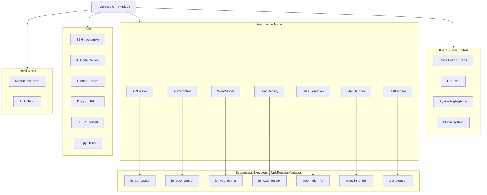

# PyBreeze: The Automation-First IDE

[](https://www.python.org/downloads/)
[](LICENSE)
[](https://doc.qt.io/qtforpython/)
[](https://pybreeze.readthedocs.io/en/latest/index.html)

[繁體中文](README/README_zh-TW.md) | [简体中文](README/README_zh-CN.md)

**PyBreeze** is a Python IDE purpose-built for automation engineers. Web, API, GUI and load testing live in one window, alongside the everyday HTTP tooling that automation work actually needs — no plugin hunting, no environment archaeology.


*The main window: an APITestka action file open in the editor, project tree on the left, run/format/debug/terminal panes below.*

---

## Table of Contents

- [A Tour in Screenshots](#a-tour-in-screenshots)
- [Four-Dimensional Automation](#four-dimensional-automation)
- [Built-in Tools](#built-in-tools)
- [AI-Assisted Development](#ai-assisted-development)
- [Plugin System](#plugin-system)
- [Multi-Language UI](#multi-language-ui)
- [Architecture](#architecture)
- [Installation](#installation)
- [Quick Start](#quick-start)
- [Integrated Automation Modules](#integrated-automation-modules)
- [Project Structure](#project-structure)
- [Dependencies](#dependencies)
- [Testing & CI](#testing--ci)
- [Target Audience](#target-audience)
- [License](#license)

---

## A Tour in Screenshots

Three menus carry most of the IDE. **Automation** runs your scripts, **Tools** opens the utility tabs, **Install** fetches the modules.

| Automation | Tools | Install |
|---|---|---|
|  |  |  |

Every automation run happens in its own subprocess. Output streams back into a run window while the editor stays responsive — stdout in the normal colour, stderr in red, and the process exit code at the end:


*A real run: PyBreeze's own curl parser invoked through the IDE's file runner, generating a pytest test.*

---

## Four-Dimensional Automation

PyBreeze covers the full spectrum of automation testing out of the box:

| Dimension | Module | What it does |
|---|---|---|
| **API** | [APITestka](https://github.com/Integration-Automation/APITestka) | RESTful testing with request builders, response analyzers, mock servers and assertions |
| **Web** | [WebRunner](https://github.com/Integration-Automation/WebRunner) | Browser-driven interaction and testing with driver and locator integration |
| **GUI** | [AutoControl](https://github.com/Integration-Automation/AutoControlGUI) | Desktop automation via image recognition, coordinates, keyboard/mouse control and recording |
| **Load** | [LoadDensity](https://github.com/Integration-Automation/LoadDensity) | High-concurrency performance testing for stability under pressure |

Plus:

- **File Automation** — file and directory operations via [automation-file](https://github.com/Integration-Automation/FileAutomation)
- **Mail Automation** — report delivery via [MailThunder](https://github.com/Integration-Automation/MailThunder)
- **Test Framework** — YAML-driven execution via [TestPioneer](https://github.com/Integration-Automation/TestPioneer)

Each module gets the same menu shape: **Run** (single script, batch directory, with or without an emailed report), **Help** (docs and GitHub open as in-IDE browser tabs), **Project** (scaffold a template directory), and where available a native GUI tab.

### IDE core

- **Automation keyword sets** — the `AT_*` / GUI / Web / Load keyword sets are registered for `.json`, and TestPioneer's schema for `.yml` and `.yaml`, on top of JEditor's language support. JEditor does not colour them yet: it highlights those files with its own rules for the suffix, which leave registered keywords out
- **Code editor** — built on [JEditor](https://github.com/Integration-Automation/JEDITOR): tabs, project tree, format checker, debugger, terminal and a git client pane
- **Script execution** — single or batch, each run in a window of its own with a Stop button (Run ▸ Stop All Program stops them all), which asks whether to stop the run when it is closed while the run goes on; action files are passed by path, and a script from the tab in front that is too long for a Windows command line (~32 KB) goes through a temporary file
- **Report generation** — HTML / JSON / XML after a run, with optional email delivery
- **Integrated JupyterLab** — launches as a tab, in the same interpreter a run would use, installing JupyterLab there if it is missing, and upgrading it and its server first when either is a release with a known vulnerability (JupyterLab before 4.5.10 or 4.6.0–4.6.1, jupyter_server before 2.20.0); the tab stays on the lab, and a link to anywhere else opens in your browser
- **Virtual environment awareness** — a run uses the interpreter chosen under **Python Env**; with none chosen, a `venv/` or `.venv/` in the working folder is detected and used, and without one, the interpreter the IDE runs on

---

## Built-in Tools

In a tool with one main button, Ctrl+Enter anywhere in it presses that button: its text boxes take Enter as a new line. In Query ↔ JSON and the URL parser/builder, which convert both ways, it goes the way the input reads: from JSON when the input is a JSON object.

### cURL Import — a copied request becomes a runnable script

Paste a `curl` command from your browser's dev tools and pick a target. The parser handles method, URL, headers, bodies, basic auth, `-G` query parameters, `-F` multipart fields (uploads become `files=open(...)`), the `--json` shortcut, `-d @file` bodies and multi-line continuations. Repeated `-H` values are combined the way HTTP combines them (`; ` for cookies, `, ` otherwise) instead of the last one silently winning. The method is the one curl sends: POST for a body and HEAD for `-I`, unless `-X` names one (`-X GET -d ...` stays a GET with a body). Nothing is ever executed — it is pure parsing.

| Target: pytest | Target: APITestka JSON action |
|---|---|
|  |  |

Targets: Python `requests`, a ready-to-run **pytest** test, **APITestka** (Python or a `[["AT_test_api_method", {...}]]` action list that `execute_files` runs directly), and a **LoadDensity** Locust load test. Copy the output, open it straight into an editor tab, or save it with the right extension. One click also hands the parsed URL to the URL parser/builder or the headers to the header analyzer.

### HAR Import — a whole session becomes a test suite

"Copy as cURL" captures one request; **Save all as HAR** captures the session. Open the export and every recorded call is listed with method, path, status and media type, with page furniture (CSS, images, fonts) filtered out by default.


Select what you want — or take everything listed — and generate one script using the same targets as the cURL importer. Repeated endpoints get numbered test names so no test silently replaces another; HTTP/2 pseudo-headers are dropped, and a `Cookie` header duplicating the recorded cookie list is removed so each value is sent once (cookies sharing a name, which a dictionary cannot hold, go as the header instead). An entry that cannot become a request, such as one with a malformed URL or method, is skipped and the rest load. A single selected request produces exactly what the cURL importer would. HAR is JSON, so this needs nothing beyond the standard library, and nothing is ever replayed for you.

### Response Inspector — paste a response, read everything in it


The status code is looked up in the HTTP reference, headers are parsed, a JSON body is pretty-printed, and any JWT anywhere in the text (an `Authorization: Bearer` header, for instance) is decoded with its timestamp claims rendered in UTC. Each finding opens in its dedicated tool tab, pre-filled.

### HTTP Header Analyzer — what a header block is actually saying


Reports names sent more than once, `Set-Cookie` entries missing `Secure` / `HttpOnly` / `SameSite`, wildcard CORS (and the wildcard-plus-credentials combination browsers reject outright), an HSTS `max-age` too short to survive a restart, CSP `unsafe-inline` / `unsafe-eval`, product banners, deprecated headers, and — for responses — the security headers that are absent. Headers carrying credentials are reported **by name only**; their values never enter the report.

### Text Diff


Compare two payloads — an expected vs. actual API response, say — and get a unified diff, its added and removed lines in the theme's colours, plus a one-line added/removed summary.

### The everyday utilities

Each is a tab or a dock, each has the same copy / open-in-editor / save-to-file row along the bottom.


- **JWT Decoder** — header and payload as pretty JSON, with `exp` / `iat` / `nbf` / `auth_time` as readable UTC. Inspection only: the signature is never verified and the token is never trusted.
- **Regex Tester** — `IGNORECASE` / `MULTILINE` / `DOTALL` / `VERBOSE`, every match with offsets, numbered groups and named groups. Enter in the pattern runs it. An invalid pattern reports a friendly error instead of crashing.
- **HTTP Status Reference** — search the full status table (sourced from the standard library, so it stays current) by code prefix or keyword.
- **JSON Format** — pretty-print or minify, with a clear validation error when the input is not JSON.


- **Timestamp Converter** — a Unix epoch (seconds, milliseconds, microseconds or nanoseconds, auto-detected) or an ISO-8601 date-time (with `Z`, `+08`, `+0800` or `+08:00`, any number of fraction digits, basic or extended) in, every representation out in UTC. Deterministic and independent of the local time zone.
- **Hash Generator** — SHA-256, SHA-512, SHA-1 and MD5 at once (MD5/SHA-1 for interoperability with `usedforsecurity=False`, never for security decisions).
- **Query ⇄ JSON** — `application/x-www-form-urlencoded` to pretty JSON and back; repeated keys become arrays and vice versa.
- **URL Parser / Builder** — scheme, host, port, path, query, fragment and credentials as an editable JSON object, and back again. Brackets IPv6 literals and re-encodes query parameters for you.

### Diagram Editor — architecture diagrams without leaving the IDE


*A Mermaid `flowchart` pasted into the importer and laid out automatically.*

A WYSIWYG `QGraphicsScene` editor: rectangle, rounded, ellipse and diamond nodes, bezier connections with edge labels, free text and images. Mermaid `flowchart` / `graph` import reads labels as Mermaid shows them (`<br>` line breaks, `#quot;` / `#9829;` entity codes) and runs a Sugiyama-style layout (layering, crossing reduction, cross-axis alignment). Save and open as `.diagram.json`, export to PNG or SVG, with undo/redo, align, distribute, grid, snap and zoom. Images fetched from a URL are SSRF-validated and size-capped.

### SSH Client — terminal and remote file tree side by side


Password or private-key authentication (the key file picked with Browse, starting in `~/.ssh`: an RSA, Ed25519 or ECDSA key in OpenSSH or PEM format, PKCS#8 included; a PuTTY `.ppk` key is exported from PuTTYgen as an OpenSSH key first, as the error message says; with key authentication the password field reads Passphrase and takes the key's passphrase), an interactive shell with keepalive that shows ANSI colours, in a fixed-pitch font, whose width and height the shell is told as the view is resized (Up and Down bring back earlier commands, Enter on an empty line reaches the shell, `clear` and `reset` wipe the view, and **Interrupt**, or Ctrl+C in the command line with nothing selected, stops what runs in it; the view shows output line by line, so programs that draw on the whole screen by moving the cursor, such as `vim` or `htop`, come out garbled), and a lazy-loading SFTP tree with create-folder / rename / delete / upload / download (F2 renames and Delete deletes the entry in focus, as in the project tree). Every SFTP request runs in the background, so a stalled link never freezes the IDE. An upload asks before it replaces a file on the server, and a transfer can be cancelled from the tree's menu. Both directions write to a temporary file first, so a dropped link leaves the old copy whole. Unknown host keys are **not** auto-accepted: the SHA256 fingerprint is shown for confirmation on first connection (trust on first use) and persisted to `~/.pybreeze/ssh_known_hosts`; hosts in `~/.ssh/known_hosts` are trusted as well. A host trusted before that shows another key is refused without a question, naming both SHA256 fingerprints and the file to remove its line from if the key was changed on purpose.

### And also

- **File Tree Context Menu** — right-click to create, rename, delete, copy absolute or relative paths, or reveal the item in your platform file manager (a file shown selected in Explorer and Finder). F2 renames and Delete deletes the item in focus while the tree has the focus. A delete asks first, with No as the default, and moves the item to the trash (the Recycle Bin on Windows); where there is none, as on some network drives, it asks again before deleting for good. Renaming or deleting a file open in an editor tab keeps the tab in sync.
- **Package Manager** — install automation modules and build tools from the menu, output in a run window.
- **Integrated Documentation** — each module's docs and GitHub page open as in-IDE browser tabs (TestPioneer's documentation is its GitHub README).

---

## AI-Assisted Development

As in the tools, Ctrl+Enter in AI Code Review, CoT Code Review or Skill Send presses its send button.

### AI Code Review


*Shown in the pre-send state.* Send a selection to an LLM endpoint (as the form field `code` in the body of a POST, the default, or a PUT; GET and DELETE send the URL alone), then accept or reject the suggestion — the tally is kept in `~/.pybreeze/response_stats.txt`. The URL is SSRF-validated, the connection goes only to the address that was checked, redirects are not followed, and the response body is size-capped before it reaches the panel. An endpoint on this machine or on a private network, such as a local model server, is therefore refused; CoT Code Review and Skill Send check their endpoint URL the same way.

### Chain-of-Thought Code Review (prthinker)

Run the [prthinker](https://github.com/JE-Chen/Code-Review-Framework-Combining-Large-Language-Models-and-Chain-of-Thought-Reasoning) pipeline over the file being edited or over a Pull Request, with output streaming into a run window.


One settings form holds the inference backend (`remote`, `local`, OpenAI-compatible, Anthropic, Gemini, Cohere, Mistral, `claude-cli`, `codex-cli`), the code host (GitHub / GitLab / Gitea) and the repository. **Keys and tokens are handed to the review as environment variables, never on a command line** where a process list would show them — and they are masked in logs. The model name goes to whichever backend is chosen. Gemini, Cohere and Mistral have no key field: chosen, the form names the variable prthinker reads their key from (`PRTHINKER_GEMINI_API_KEY`, `PRTHINKER_COHERE_API_KEY`, `PRTHINKER_MISTRAL_API_KEY`), which is set before PyBreeze starts. Rule retrieval (RAG) is `off` unless set to `remote`, which asks the prthinker server's `/rag`: prthinker's local rule index ships with its repository, not with the package installed from it. The review runs with the interpreter chosen in `Python Env`, so PyBreeze itself can stay on an older Python than the 3.12 prthinker needs.

### CoT Prompt Editor


Create and manage the multi-step review chain: first summary → first code review → a judge of that review → linter → code smell detector → step-by-step analysis → total summary → a judge of the summary. Each step quotes the answers it needs from the steps before it. Files are watched, so an external edit shows up immediately.

Run the chain from **Tools → AI → CoT Code Review** (a tab, or a dock from the Dock menu): paste the code, give the endpoint URL, and each step's answer appears in the selector as it arrives. Each step is a POST of the JSON `{"prompt": "..."}`, and the response body, as text, is that step's answer.

### Skill Prompt Editor & Skill Send

| Skill prompt editor | Skill send |
|---|---|
|  |  |

Define reusable skill prompts (code explanation, code review), then pick one, edit it if needed, and send it to an LLM endpoint from a dedicated tab or dock: a POST of the JSON `{"code": "..."}` holding the prompt, whose response body is shown as it is. *Both shown in the pre-send state — no endpoint was contacted for these screenshots.*

---

## Plugin System

PyBreeze inherits JEditor's plugin architecture, auto-discovered from a `jeditor_plugins/` directory in the working directory. A plugin can register:

- **Syntax highlighting** — keyword sets and rules for a file suffix JEditor does not colour itself (for `.c`, `.cpp`, `.go`, `.java`, `.js`, `.json`, `.rs`, `.sh`, `.sql`, `.toml`, `.ts`, `.yaml` and the other suffixes it colours, its own rules are used)
- **UI translations** — new interface languages
- **Run configurations** — "Run with…" for interpreted (`go run main.go`) and compiled (`gcc main.c -o main` then run) languages, executed through PyBreeze's `FileRunnerProcess` with the compiled artifact cleaned up afterwards
- **Plugin Browser** — browse and install plugins from remote repositories inside the IDE, from **Plugins → Plugin Browser**, which is there before any plugin is installed; an installed plugin loads at the next start

Loaded plugins appear under their own **Plugins** menu with an About entry and one run action, labelled with the suffixes it runs. [PLUGIN_GUIDE.md](PLUGIN_GUIDE.md) covers what PyBreeze adds and links JEditor's guide, which has the full API and worked examples (C, C++, Go, Java, Rust, and a French translation).

---

## Multi-Language UI

- **English** (default)
- **Traditional Chinese** (繁體中文)

Menus, dialogs, the reasons a tool refuses its input and the run window's own notices (`[Error] …`, `[Run] …`) all follow the chosen language. Both dictionaries carry the same 764 keys, and a test enforces that parity so a new string can never land in one language only. The Language menu also lists JEditor's Japanese and Simplified Chinese: picked, JEditor's own menus change and PyBreeze's strings stay in English. Further languages can be added via translation plugins.

---

## Architecture



**The editor process never runs your script.** Every automation module is launched as `python -m <package>` in the project's interpreter with `shell=False`. Two daemon threads read stdout and stderr into thread-safe queues; a 100 ms `QTimer` drains them onto the UI thread in bounded batches. A crash, a hang or an infinite print loop in a script cannot take the IDE with it.

For a module-by-module walkthrough of the codebase, see [architecture_explore.md](architecture_explore.md).

---

## Installation

### From PyPI

```bash
pip install pybreeze
```

### From source

```bash
git clone https://github.com/Integration-Automation/PyBreeze.git
cd PyBreeze
pip install -r requirements.txt
```

### System requirements

- **Python**: 3.10 – 3.14
- **OS**: Windows, macOS, Linux
- **GUI**: PySide6 6.11.2 (installed automatically)

---

## Quick Start

```bash
python -m pybreeze                # command line
python exe/start_pybreeze.py      # from the exe directory
```

```python
from pybreeze import start_editor

start_editor()                              # the theme picked from UI Style (dark_amber until one is)
start_editor(theme="dark_teal.xml")         # any qt_material theme; it becomes the picked one
```

Once launched:

1. **Write** an automation script in the editor
2. **Run** it from the `Automation` menu, picking the target module
3. **Watch** the output stream into the run window
4. **Generate** an HTML / JSON / XML report
5. **Send** it by email through the MailThunder integration

### Log file

PyBreeze writes its log to `~/.pybreeze/logs/PyBreeze.log`: UTF-8, appended to by every run, each line carrying the process ID. Only warnings and errors also appear in the editor's Code Result panel. Two environment variables change this:

| Variable | Effect |
|---|---|
| `PYBREEZE_LOG_FILE` | The log file to write instead |
| `PYBREEZE_LOG_MAX_BYTES` | When a PyBreeze process first writes to the log and the file is larger than this many bytes, the file is first renamed with `.1` appended, replacing the previous one (default 104857600, 100 MB; `0` never renames it) |

---

## Integrated Automation Modules

| Module | Capabilities |
|---|---|
| **APITestka** | HTTP methods, async via httpx, Flask mock servers, HTML/JSON/XML reports, scheduler triggers, socket server, JSON-schema and JSONPath assertions, SLA checks, record-replay cassettes |
| **AutoControl** | Mouse (click, drag, scroll, position), keyboard (type, hotkey, press/release), image recognition and locate-and-click, screenshots, record and playback, shell and process control |
| **WebRunner** | Browser driver integration, element location and interaction, web test scripting, reports |
| **LoadDensity** | Concurrent request simulation, performance metrics, stress scenario management, reports |
| **MailThunder** | SMTP sending, HTML report delivery, attachments, environment-variable configuration |
| **TestPioneer** | YAML test definitions, template generation, structured execution; `Install ▸ Automation ▸ Install TestPioneer` installs or upgrades it (0.1.34 and later read a YAML file as UTF-8 whatever the system locale) |
| **File Automation** | Automated file and directory operations, batch processing |
| **prthinker** | Chain-of-thought code review of a file or a Pull Request; settings in `~/.pybreeze/prthinker_setting.json`; installed from its own source folder via `Install ▸ Automation ▸ Install prthinker` (needs Python 3.12+) |

---

## Project Structure

```
PyBreeze/
├── pybreeze/
│   ├── __init__.py                    # Public API (start_editor, plugin re-exports)
│   ├── __main__.py                    # Entry point (python -m pybreeze)
│   ├── extend/
│   │   ├── process_executor/          # Subprocess isolation layer
│   │   │   ├── python_task_process_manager.py   # TaskProcessManager (core)
│   │   │   ├── process_executor_utils.py        # build_process / start_process
│   │   │   ├── file_runner_process.py           # Plugin run configs (any language)
│   │   │   ├── queue_pump.py                    # Shared pipe reader + QTimer drain
│   │   │   ├── test_pioneer/ prthinker/
│   │   ├── mail_thunder_extend/       # Post-test email report hook
│   │   └── prthinker_extend/          # prthinker settings & argument assembly
│   ├── extend_multi_language/         # Built-in i18n (English, Traditional Chinese)
│   ├── pybreeze_ui/
│   │   ├── editor_main/               # Main window + file tree context menu
│   │   ├── menu/                      # Automation / install / tools / plugin menus
│   │   ├── tools_gui/                 # cURL, HAR, JWT, diff, regex, … tool tabs
│   │   ├── diagram_editor/            # WYSIWYG diagram editor
│   │   ├── extend_ai_gui/             # CoT review, prompt editors, skill send
│   │   ├── connect_gui/               # SSH terminal + SFTP tree, AI review client
│   │   ├── jupyter_lab_gui/           # JupyterLab tab
│   │   ├── show_code_window/          # CodeWindow (run output)
│   │   ├── dialog/                    # prthinker settings dialog
│   │   └── syntax/                    # Automation keyword definitions
│   └── utils/                         # curl/HAR parsing, headers, JWT, hashing,
│                                      # URL validation, logging, exceptions, …
├── exe/                               # Standalone launcher & build configs
├── docs/                              # Sphinx documentation source; updates/ is the change log
├── test/                              # Unit tests (test_utils) + startup tests
├── images/                            # Screenshots
├── architecture.md                    # Architecture overview: layers, flows, cross-project contracts
├── architecture_explore.md            # Module-by-module architecture notes
├── progress.md                        # Work still to do
├── PLUGIN_GUIDE.md                    # Plugin development documentation
├── pyproject.toml                     # Package configuration (stable)
├── dev.toml                           # Package configuration (dev channel)
└── requirements.txt                   # Runtime dependencies
```

---

## Dependencies

### Runtime

| Package | Purpose |
|---|---|
| `PySide6` (6.11.2) | GUI framework (Qt for Python) |
| `je-editor` | Base code editor engine |
| `je_api_testka` | API testing automation |
| `je_auto_control` | GUI/desktop automation |
| `je_web_runner` | Web browser automation |
| `je_load_density` | Load and stress testing |
| `je-mail-thunder` | Email automation |
| `automation-file` | File operation automation |
| `test_pioneer` | YAML-based test framework |
| `paramiko` | SSH client support |
| `jupyterlab` | Integrated notebook environment |

### Development

`build`, `twine`, `sphinx`, `sphinx-rtd-theme`, `auto-py-to-exe`, `pytest`, `pytest-cov`, `hypothesis`, `ruff`

---

## Testing & CI

```bash
python -m pip install -r dev_requirements.txt
python -m pytest test/test_utils/ -v --tb=short
```

- **Unit tests** — `test/test_utils/`, covering the pure-logic layer (curl and HAR parsing, header analysis, SSRF validation, JWT, hashing, timestamps, diffing) plus headless Qt widget tests via `QT_QPA_PLATFORM=offscreen`, with Hypothesis property tests over the parsers. The SSH terminal and the SFTP file tree also log in to an SSH server the tests start on the loopback address, which serves a temporary folder over SFTP
- **Startup tests** — `test/unit_test/start_automation/` launches the IDE in debug mode and verifies it comes up and exits cleanly
- **CI** — GitHub Actions on Windows across Python 3.10 – 3.14, on every push and PR plus a nightly run
- **Static analysis** — SonarCloud, Codacy and Bandit

---

## Target Audience

- **Python developers** — a lightweight, dedicated environment for automation scripts without the overhead of a general-purpose IDE
- **SDETs** — one tool for Web, API and performance tests maintained side by side
- **Automation beginners** — zero-config environment setup and a menu for every module
- **DevOps teams** — a place to build and debug integration suites destined for CI/CD

---

## License

MIT — see [LICENSE](LICENSE). Copyright (c) 2022 JE-Chen

---

<sub>Screenshots are rendered from the actual PyBreeze widgets on Windows 11 with the default `dark_amber` theme; the sample data in each tool is real input processed by the real code path.</sub>
