# PyBreeze：自动化优先的 IDE

[](https://www.python.org/downloads/)
[](../LICENSE)
[](https://doc.qt.io/qtforpython/)
[](https://pybreeze.readthedocs.io/en/latest/index.html)

[English](../README.md) | [繁體中文](README_zh-TW.md)

**PyBreeze** 是一款专为自动化工程师打造的 Python IDE。Web、API、GUI 和负载测试都在同一个窗口里，旁边还有自动化工作真正需要的日常 HTTP 工具——不用到处找插件，也不用费力考究环境。

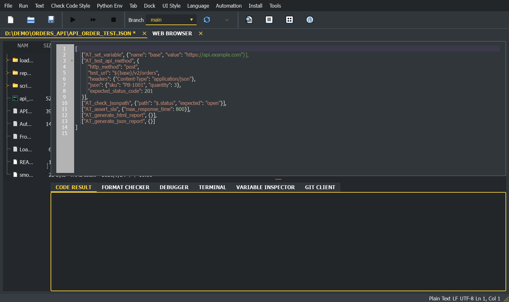

*主窗口：编辑器打开着一个 APITestka 动作文件，左侧是项目树，下方是运行／格式检查／调试／终端面板。*

---

## 目录

- [截图导览](#截图导览)
- [四维自动化](#四维自动化)
- [内置工具](#内置工具)
- [AI 辅助开发](#ai-辅助开发)
- [插件系统](#插件系统)
- [多语言界面](#多语言界面)
- [架构](#架构)
- [安装](#安装)
- [快速开始](#快速开始)
- [集成自动化模块](#集成自动化模块)
- [项目结构](#项目结构)
- [依赖项](#依赖项)
- [测试与 CI](#测试与-ci)
- [目标用户](#目标用户)
- [许可证](#许可证)

---

## 截图导览

IDE 的大部分功能都在三个菜单里。**Automation** 运行你的脚本，**Tools** 打开各种工具标签页，**Install** 安装各个模块。

| Automation | Tools | Install |
|---|---|---|
| 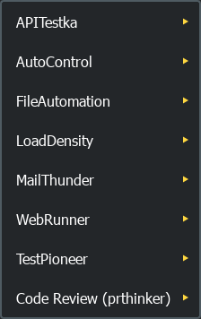 | 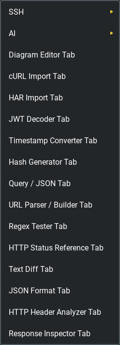 | 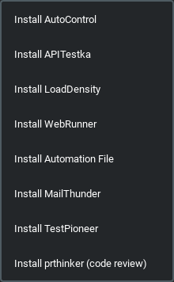 |

每次自动化运行都在独立的子进程中进行。输出会流回运行窗口，编辑器始终保持响应——stdout 以普通颜色显示，stderr 以红色显示，最后是进程的退出码：

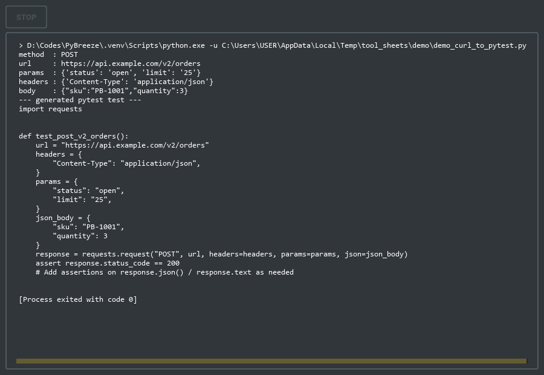

*一次真实的运行：通过 IDE 的文件运行器调用 PyBreeze 自带的 curl 解析器，生成一个 pytest 测试。*

---

## 四维自动化

PyBreeze 开箱即用，涵盖自动化测试的完整范围：

| 维度 | 模块 | 功能 |
|---|---|---|
| **API** | [APITestka](https://github.com/Integration-Automation/APITestka) | RESTful 测试，包含请求构建器、响应分析器、Mock 服务器与断言 |
| **Web** | [WebRunner](https://github.com/Integration-Automation/WebRunner) | 由浏览器驱动的交互与测试，集成驱动程序与元素定位器 |
| **GUI** | [AutoControl](https://github.com/Integration-Automation/AutoControlGUI) | 桌面自动化：图像识别、坐标、键盘／鼠标控制与录制 |
| **Load** | [LoadDensity](https://github.com/Integration-Automation/LoadDensity) | 高并发性能测试，检验系统在压力下的稳定性 |

此外还有：

- **文件自动化** — 通过 [automation-file](https://github.com/Integration-Automation/FileAutomation) 进行文件与目录操作
- **邮件自动化** — 通过 [MailThunder](https://github.com/Integration-Automation/MailThunder) 投递报告
- **测试框架** — 通过 [TestPioneer](https://github.com/Integration-Automation/TestPioneer) 进行 YAML 驱动的执行

每个模块的菜单结构都相同：**Run**（单个脚本、整个目录批量运行，可选择是否以邮件发送报告）、**Help**（文档与 GitHub 以 IDE 内的浏览器标签页打开）、**Project**（生成模板目录），有原生 GUI 的模块还会提供一个 GUI 标签页。

### IDE 核心

- **自动化关键字集** — 在 JEditor 的语言支持之上，为 `.json` 注册了 `AT_*` / GUI / Web / Load 关键字集，为 `.yml` 和 `.yaml` 注册了 TestPioneer 的结构定义。JEditor 目前还不会为它们着色：它用自己针对这些扩展名的规则高亮，不会用到注册的关键字
- **代码编辑器** — 基于 [JEditor](https://github.com/Integration-Automation/JEDITOR) 构建：标签页、项目树、格式检查、调试器、终端以及 git 客户端面板
- **脚本执行** — 单个或批量运行，每次运行都有自己的窗口和 Stop 按钮（Run ▸ Stop All Program 会全部停止），运行中关闭窗口时会先询问是否停止；动作文件以路径传入，而前台标签页中的脚本若超出 Windows 命令行的长度上限（约 32 KB），会改经临时文件传递
- **报告生成** — 运行后生成 HTML / JSON / XML 报告，可选以邮件发送
- **集成 JupyterLab** — 以标签页方式启动，使用与运行脚本相同的解释器；那里没有 JupyterLab 时会自动安装，JupyterLab 或它的服务器是存在已知漏洞的版本时（JupyterLab 4.5.10 之前或 4.6.0–4.6.1、jupyter_server 2.20.0 之前）会先升级；标签页只停留在 lab 上，指向其他地方的链接会用你的浏览器打开
- **虚拟环境感知** — 运行时使用在 **Python Env** 中选择的解释器；没有选择时，自动检测并使用工作文件夹中的 `venv/` 或 `.venv/`，都没有时则以 IDE 本身所用的解释器运行

---

## 内置工具

只有一个主要按钮的工具，在工具里任何地方按 Ctrl+Enter 就等于按下那个按钮：文本框里的 Enter 是换行。Query ↔ JSON 与 URL 解析／构建器可以双向转换，Ctrl+Enter 会根据输入决定方向：输入是 JSON 对象时从 JSON 转出。

### cURL 导入——复制的请求变成可运行的脚本

从浏览器开发者工具粘贴一条 `curl` 命令，选择目标格式。解析器能处理方法、URL、请求头、请求体、basic auth、`-G` 查询参数、`-F` multipart 字段（上传会变成 `files=open(...)`）、`--json` 简写、`-d @file` 请求体以及多行续行。重复的 `-H` 值会按照 HTTP 的方式合并（cookie 用 `; `，其他用 `, `），而不是悄悄只保留最后一个。方法与 curl 实际发出的一致：有请求体就是 POST、`-I` 是 HEAD，除非 `-X` 指定了方法（`-X GET -d ...` 仍是带请求体的 GET）。它从不执行任何东西——纯粹只做解析。

| 目标：pytest | 目标：APITestka JSON 动作 |
|---|---|
| 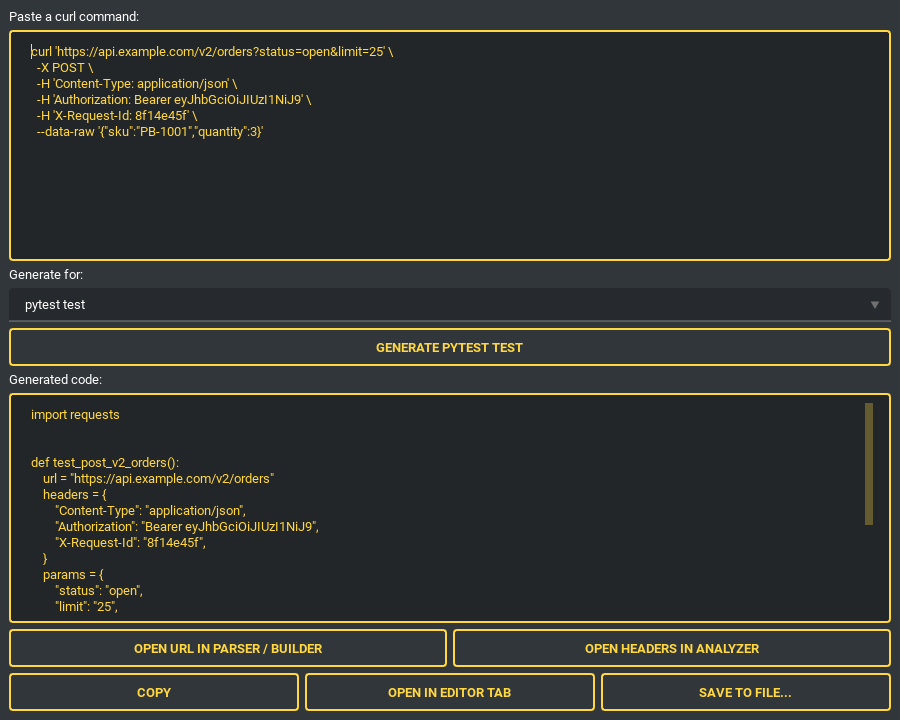 | 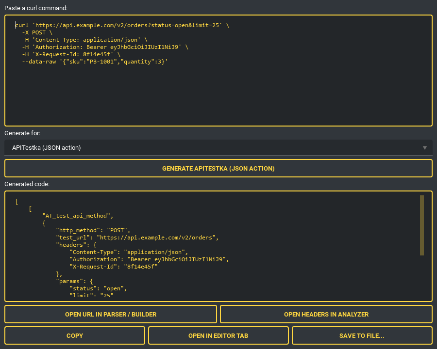 |

目标格式：Python `requests`、可直接运行的 **pytest** 测试、**APITestka**（Python，或可由 `execute_files` 直接运行的 `[["AT_test_api_method", {...}]]` 动作列表），以及 **LoadDensity** 的 Locust 负载测试。可以复制输出、直接在编辑器标签页中打开，或以正确的扩展名保存。只需一次点击，还能把解析出的 URL 交给 URL 解析器／构建器，或把请求头交给请求头分析器。

### HAR 导入——整个会话变成测试套件

"Copy as cURL" 只能抓一个请求；**Save all as HAR** 能抓下整个会话。打开导出的文件，每个记录下来的调用都会列出方法、路径、状态码与媒体类型，页面装饰资源（CSS、图片、字体）默认会被过滤掉。

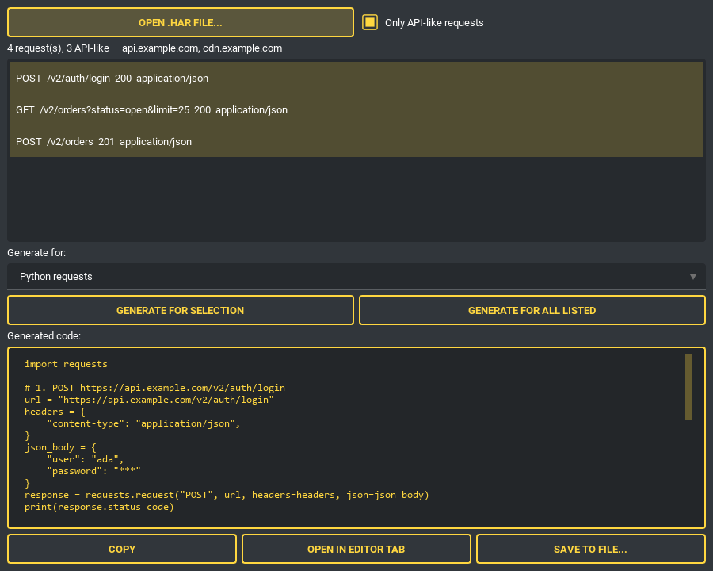

选择想要的请求——或者直接全选列出的项目——用与 cURL 导入器相同的目标格式生成一个脚本。重复的端点会得到编号的测试名称，不会有测试悄悄覆盖另一个；HTTP/2 伪请求头会被去掉，与记录的 cookie 列表重复的 `Cookie` 请求头也会被移除，让每个值只发送一次（同名的 cookie 无法放进字典，则改以请求头发送）。无法变成请求的条目（例如 URL 或方法格式错误）会被跳过，其余照常加载。只选一个请求时，生成的结果与 cURL 导入器完全相同。HAR 就是 JSON，因此只需要标准库，而且从不会替你重放任何请求。

### 响应检查器——粘贴一个响应，读懂其中的一切

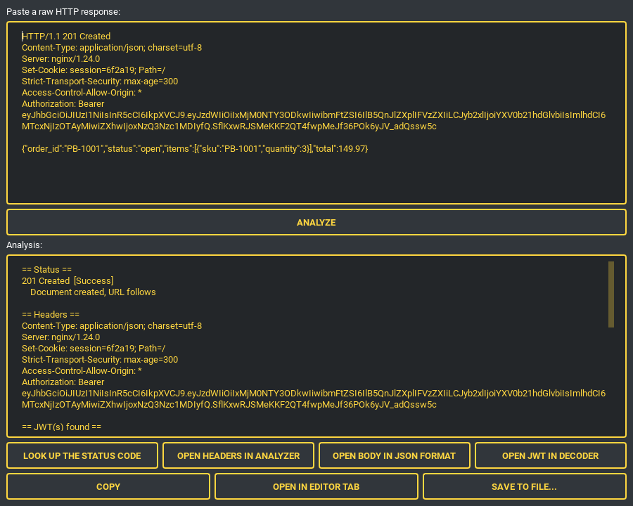

状态码会在 HTTP 参考表中查找，请求头会被解析，JSON 响应体会被格式化，文本中任何位置的 JWT（例如 `Authorization: Bearer` 请求头）都会被解码，其中的时间戳声明以 UTC 显示。每项发现都能在对应的工具标签页中打开，并已预先填好。

### HTTP 请求头分析器——一组请求头实际上在说什么

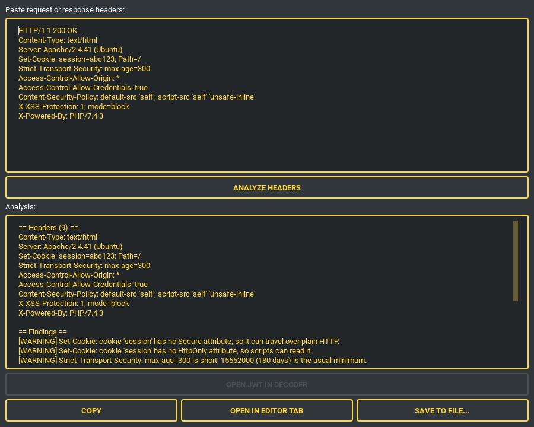

会报告：重复发送的名称、缺少 `Secure` / `HttpOnly` / `SameSite` 的 `Set-Cookie`、通配符 CORS（以及浏览器会直接拒绝的"通配符加凭据"组合）、短到撑不过一次重启的 HSTS `max-age`、CSP 的 `unsafe-inline` / `unsafe-eval`、产品标识、已弃用的请求头，以及——针对响应——缺少的安全请求头。携带凭据的请求头**只报告名称**；它们的值绝不会进入报告。

### 文本比较

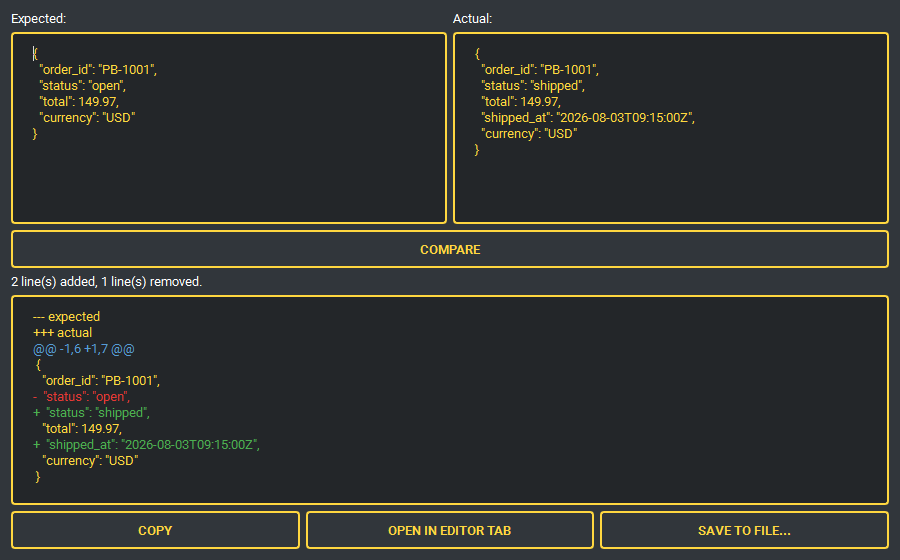

比较两份数据——例如预期与实际的 API 响应——得到 unified diff（新增与删除的行以主题的颜色标示），以及一行新增／删除的摘要。

### 日常小工具

每个都是一个标签页或停靠面板，底部都有相同的一排按钮：复制／在编辑器中打开／保存到文件。

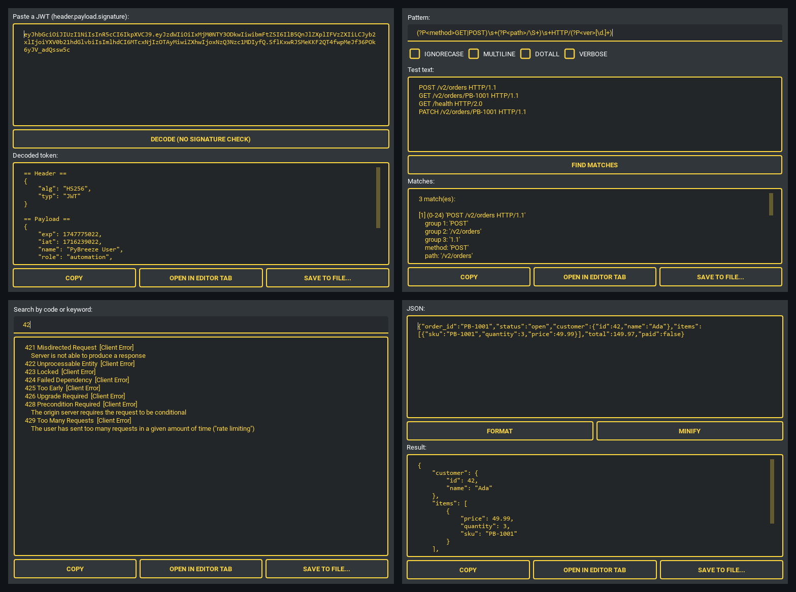

- **JWT 解码器** — header 与 payload 以格式化的 JSON 显示，`exp` / `iat` / `nbf` / `auth_time` 以易读的 UTC 显示。只做查看：从不验证签名，也从不信任令牌。
- **正则表达式测试器** — 支持 `IGNORECASE` / `MULTILINE` / `DOTALL` / `VERBOSE`，列出每个匹配及其偏移量、编号分组与命名分组。在模式框中按 Enter 即可运行。无效的模式会显示友好的错误信息，而不会崩溃。
- **HTTP 状态码参考** — 按状态码前缀或关键字搜索完整的状态码表（来自标准库，因此始终保持最新）。
- **JSON 格式化** — 格式化或压缩，输入不是 JSON 时给出清楚的验证错误。

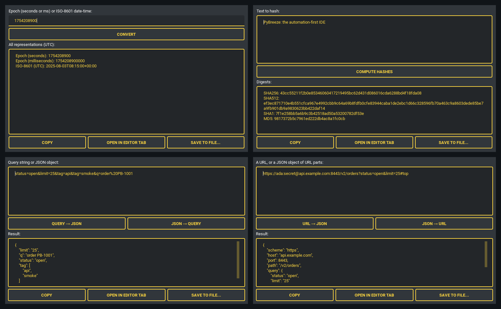

- **时间戳转换器** — 输入 Unix 时间戳（秒、毫秒、微秒或纳秒，自动识别）或 ISO-8601 日期时间（支持 `Z`、`+08`、`+0800` 或 `+08:00`，任意位数的小数，基本或扩展格式），输出所有 UTC 表示形式。结果确定，与本地时区无关。
- **哈希生成器** — 一次算出 SHA-256、SHA-512、SHA-1 与 MD5（MD5/SHA-1 以 `usedforsecurity=False` 提供，只为了互操作，绝不用于安全判断）。
- **Query ⇄ JSON** — `application/x-www-form-urlencoded` 转为格式化的 JSON，也能转回去；重复的键会变成数组，反之亦然。
- **URL 解析器／构建器** — 把 scheme、host、port、path、query、fragment 与凭据拆成可编辑的 JSON 对象，也能再组回 URL。会自动为 IPv6 字面量加上方括号，并重新编码查询参数。

### 图表编辑器——不离开 IDE 就能画架构图

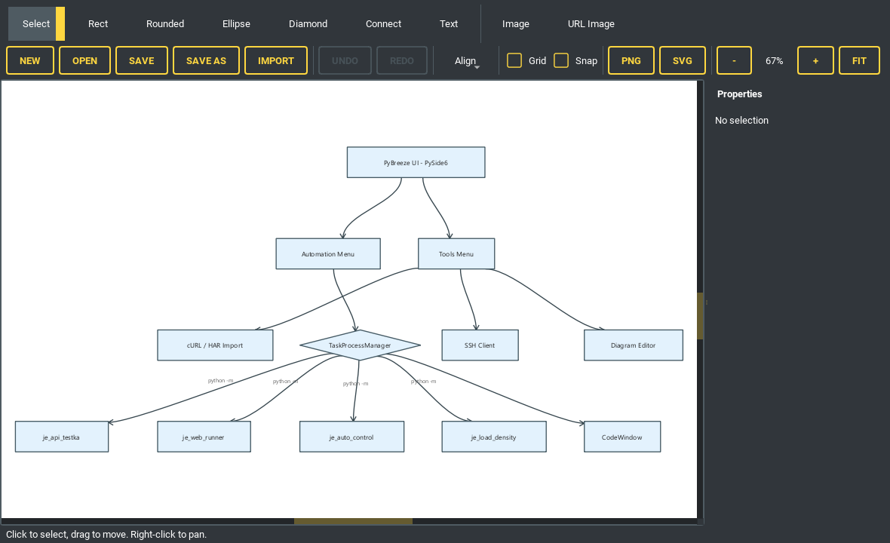

*把一段 Mermaid `flowchart` 粘贴到导入器中，自动完成布局。*

一个基于 `QGraphicsScene` 的所见即所得编辑器：矩形、圆角矩形、椭圆与菱形节点，带边标签的贝塞尔连线，自由文本与图片。Mermaid `flowchart` / `graph` 导入会按 Mermaid 的显示方式读取标签（`<br>` 换行、`#quot;` / `#9829;` 实体码），并采用 Sugiyama 式布局（分层、减少交叉、跨轴对齐）。可保存和打开 `.diagram.json`，导出为 PNG 或 SVG，支持撤销／重做、对齐、分布、网格、吸附与缩放。从 URL 获取的图片会经过 SSRF 验证并有大小上限。

### SSH 客户端——终端与远程文件树并排

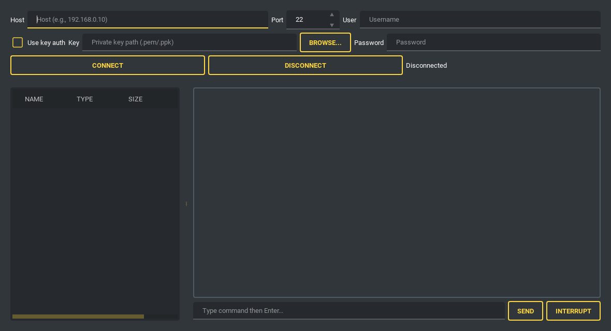

支持密码或私钥认证（用 Browse 选择密钥文件，从 `~/.ssh` 开始：OpenSSH 或 PEM 格式的 RSA、Ed25519、ECDSA 密钥，PKCS#8 也可以；PuTTY 的 `.ppk` 密钥需先在 PuTTYgen 导出为 OpenSSH 密钥，错误信息会说明如何操作；勾选密钥认证时，密码栏会改为“密语”，填入私钥的密语），带 keepalive、会显示 ANSI 颜色的交互式 shell，以等宽字体显示，窗口大小改变时会把新的宽度和高度告诉 shell（上下方向键调出之前发送的命令，空行按 Enter 也会发送到 shell，`clear` 与 `reset` 会清空画面，**Interrupt** 按钮、或在未选中文字的命令行中按 Ctrl+C，可停止 shell 中正在运行的程序；界面逐行显示输出，所以 `vim`、`htop` 这类移动光标绘制整个屏幕的程序会显示错乱），以及按需加载的 SFTP 文件树，支持创建文件夹／重命名／删除／上传／下载（和项目文件树一样，F2 重命名、Delete 删除当前项目）。每个 SFTP 请求都在后台运行，因此连接卡住时也不会冻结 IDE。上传前若会覆盖服务器上的文件会先询问，传输也可以从文件树的菜单中取消。两个方向都先写入临时文件，因此连接中断时，旧的副本仍完整保留。未知的主机密钥**不会**被自动接受：首次连接时会显示 SHA256 指纹请你确认（首次使用即信任），并保存到 `~/.pybreeze/ssh_known_hosts`；`~/.ssh/known_hosts` 中的主机也同样信任。信任过的主机若换成另一把密钥，会直接拒绝、不再询问，并列出两个 SHA256 指纹，以及密钥是有意更换时要从哪个文件删除它那一行。

### 其他

- **文件树右键菜单** — 右键即可创建、重命名、删除、复制绝对或相对路径，或在系统的文件管理器中显示该项目（在 Explorer 与 Finder 中会选中该文件）。焦点在文件树时，F2 重命名、Delete 删除当前项目。删除前会先询问，默认是“否”，删除的项目会移到回收站（Windows 的回收站）；没有回收站的地方（例如某些网络驱动器），会再询问一次才永久删除。重命名或删除一个已在编辑器标签页中打开的文件时，标签页会保持同步。
- **包管理器** — 从菜单安装自动化模块与构建工具，输出显示在运行窗口中。
- **集成文档** — 每个模块的文档与 GitHub 页面都以 IDE 内的浏览器标签页打开（TestPioneer 的文档就是它 GitHub 上的 README）。

---

## AI 辅助开发

和工具一样，在 AI 代码审查、CoT 代码审查或 Skill Send 中按 Ctrl+Enter，就等于按下发送按钮。

### AI 代码审查

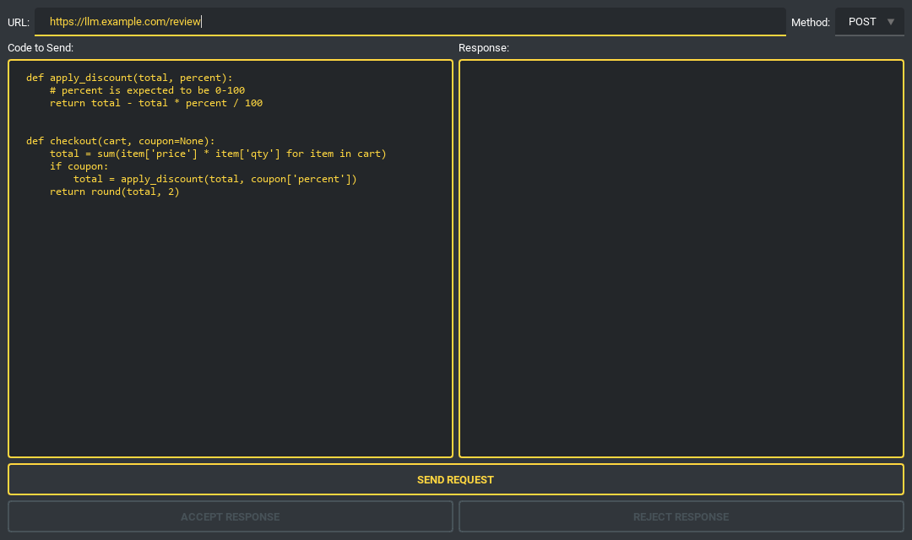

*图中为发送前的状态。* 把选中的代码发送到 LLM 端点（以 POST（默认）或 PUT 发送，代码放在请求体的表单字段 `code` 中；GET 与 DELETE 只发送 URL），然后接受或拒绝建议——统计记录保存在 `~/.pybreeze/response_stats.txt`。URL 会经过 SSRF 验证，连接只会连到经过检查的地址，不跟随重定向，响应体在到达面板之前会被限制大小。因此本机或私有网络上的端点（例如在本机运行的模型服务器）会被拒绝；CoT Code Review 与 Skill Send 也以同样的方式检查端点 URL。

### 思维链代码审查（prthinker）

对正在编辑的文件或一个 Pull Request 运行 [prthinker](https://github.com/JE-Chen/Code-Review-Framework-Combining-Large-Language-Models-and-Chain-of-Thought-Reasoning) 流程，输出实时流入运行窗口。

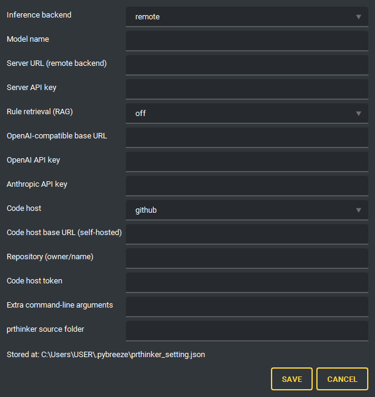

一张设置表就包含推理后端（`remote`、`local`、OpenAI 兼容、Anthropic、Gemini、Cohere、Mistral、`claude-cli`、`codex-cli`）、代码托管平台（GitHub / GitLab / Gitea）与仓库。**密钥与令牌以环境变量交给审查，绝不放在命令行上**——那是进程列表看得到的地方——并且在日志中会被遮蔽。模型名称会交给所选的后端。Gemini、Cohere、Mistral 没有密钥栏位：选中它们时，设置表会说明 prthinker 从哪个环境变量读取密钥（`PRTHINKER_GEMINI_API_KEY`、`PRTHINKER_COHERE_API_KEY`、`PRTHINKER_MISTRAL_API_KEY`），需在启动 PyBreeze 之前设置。规则检索（RAG）默认为 `off`，除非设为 `remote`，此时会向 prthinker 服务器的 `/rag` 查询：prthinker 的本地规则索引随它的仓库提供，而不在从仓库安装的包里。审查以 `Python Env` 中选择的解释器运行，因此 PyBreeze 本身可以停留在比 prthinker 所需的 3.12 更旧的 Python 上。

### CoT 提示词编辑器

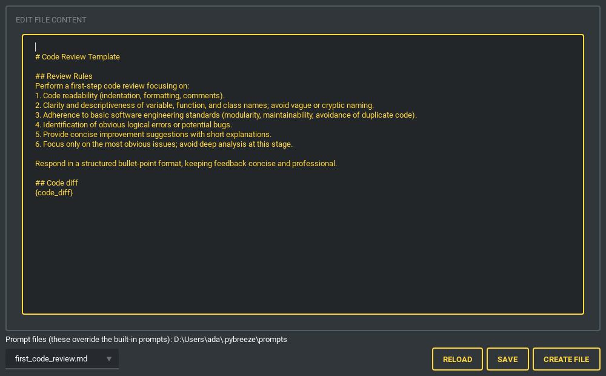

创建和管理多步骤的审查链：第一次摘要 → 第一次代码审查 → 对该审查的评判 → linter → 代码坏味道检测 → 逐步分析 → 总摘要 → 对摘要的评判。每一步都会引用它所需的前面步骤的回答。文件受到监视，因此外部的编辑会立即显示出来。

从 **Tools → AI → CoT Code Review**（一个标签页，或从 Dock 菜单打开停靠面板）运行这条审查链：粘贴代码，填入端点 URL，每一步的回答一到达就会出现在选择器中。每一步都以 POST 发送 JSON `{"prompt": "..."}`，响应体（按文本读取）就是这一步的回答。

### Skill 提示词编辑器与 Skill Send

| Skill 提示词编辑器 | Skill Send |
|---|---|
| 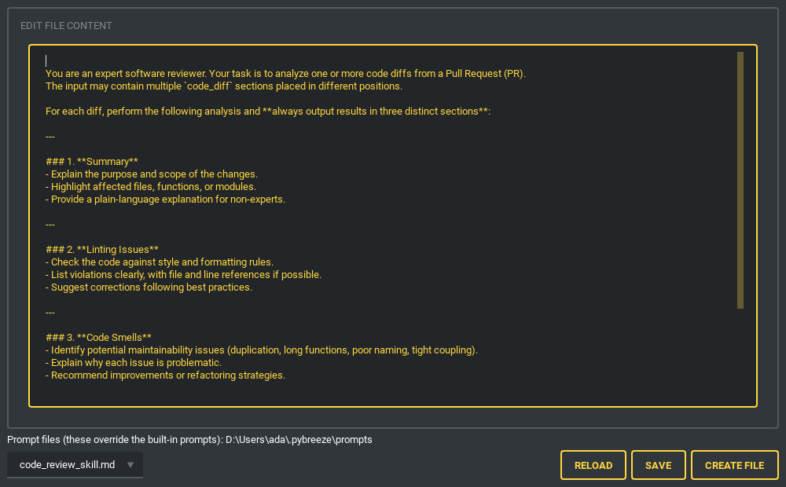 | 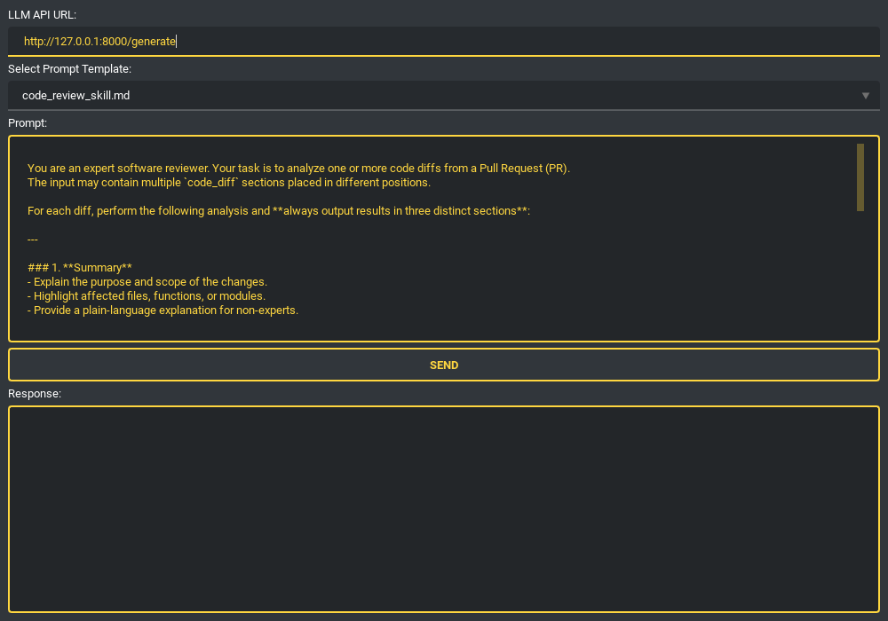 |

定义可重复使用的技能提示词（代码解说、代码审查），然后选择一个，按需编辑，再从专用的标签页或停靠面板发送到 LLM 端点：以 POST 发送装有提示词的 JSON `{"code": "..."}`，响应体按原样显示。*两张图都是发送前的状态——拍摄这些截图时没有连接任何端点。*

---

## 插件系统

PyBreeze 继承了 JEditor 的插件架构，会从工作目录下的 `jeditor_plugins/` 目录自动发现插件。插件可以注册：

- **语法高亮** — JEditor 自身不着色的文件扩展名的关键字集与规则（`.c`、`.cpp`、`.go`、`.java`、`.js`、`.json`、`.rs`、`.sh`、`.sql`、`.toml`、`.ts`、`.yaml` 等 JEditor 会着色的扩展名，使用的是它自己的规则）
- **界面翻译** — 新的界面语言
- **运行配置** — 为解释型（`go run main.go`）与编译型（`gcc main.c -o main` 后再运行）语言提供"Run with…"，通过 PyBreeze 的 `FileRunnerProcess` 执行，编译产物在运行后会被清理
- **插件浏览器** — 在 IDE 内从远程仓库浏览并安装插件，入口是 **Plugins → Plugin Browser**，尚未安装任何插件时也在；装好的插件在下次启动时加载

已加载的插件会出现在它们自己的 **Plugins** 菜单下，包含一个 About 项与一个运行动作，标签上注明它能运行的文件扩展名。[PLUGIN_GUIDE.md](../PLUGIN_GUIDE.md) 介绍 PyBreeze 额外提供的内容，并链接到 JEditor 的指南，那里有完整的 API 与示例（C、C++、Go、Java、Rust，以及一份法语翻译）。

---

## 多语言界面

- **English**（默认）
- **繁體中文**（Traditional Chinese）

菜单、对话框、工具拒绝输入时给出的原因，以及运行窗口自身的提示（`[Error] …`、`[Run] …`）都会跟随所选语言。两份词典包含同样的 764 个键，并有测试确保两者一致，因此新字符串绝不会只出现在一种语言中。语言菜单还列出 JEditor 的日文与简体中文：选择后 JEditor 自己的菜单会随之改变，PyBreeze 的字符串则保持英文。其他语言可以通过翻译插件添加。

---

## 架构

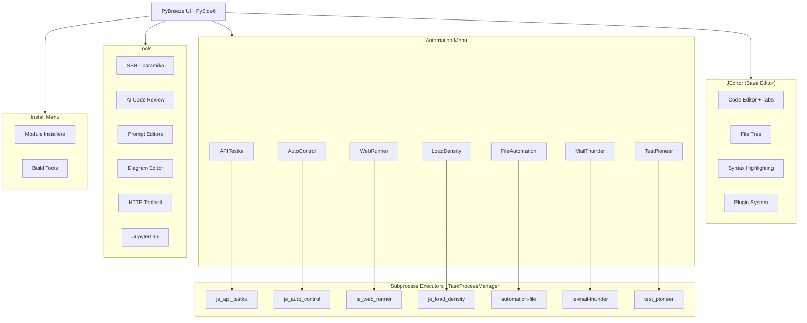
```mermaid
flowchart TB
    UI["PyBreeze UI · PySide6"]

    subgraph Editor["JEditor (Base Editor)"]
        direction LR
        E1["Code Editor + Tabs"]
        E2["File Tree"]
        E3["Syntax Highlighting"]
        E4["Plugin System"]
    end

    subgraph Automation["Automation Menu"]
        direction LR
        A1["APITestka"]
        A2["AutoControl"]
        A3["WebRunner"]
        A4["LoadDensity"]
        A5["FileAutomation"]
        A6["MailThunder"]
        A7["TestPioneer"]
    end

    subgraph Executors["Subprocess Executors · TaskProcessManager"]
        direction LR
        X1["je_api_testka"]
        X2["je_auto_control"]
        X3["je_web_runner"]
        X4["je_load_density"]
        X5["automation-file"]
        X6["je-mail-thunder"]
        X7["test_pioneer"]
    end

    subgraph Tools["Tools"]
        direction LR
        T1["SSH · paramiko"]
        T2["AI Code Review"]
        T3["Prompt Editors"]
        T4["Diagram Editor"]
        T5["HTTP Toolbelt"]
        T6["JupyterLab"]
    end

    subgraph Install["Install Menu"]
        direction LR
        I1["Module Installers"]
        I2["Build Tools"]
    end

    UI --> Editor
    UI --> Automation
    UI --> Tools
    UI --> Install

    A1 --> X1
    A2 --> X2
    A3 --> X3
    A4 --> X4
    A5 --> X5
    A6 --> X6
    A7 --> X7
```

**编辑器进程从不运行你的脚本。** 每个自动化模块都以 `python -m <package>` 的方式、用项目的解释器、以 `shell=False` 启动。两个守护线程把 stdout 与 stderr 读入线程安全的队列；一个 100 ms 的 `QTimer` 以有上限的批次把它们送到 UI 线程。脚本崩溃、卡住或无限打印，都不会拖垮 IDE。

逐个模块的代码导览请参阅 [architecture_explore.md](../architecture_explore.md)。

---

## 安装

### 从 PyPI 安装

```bash
pip install pybreeze
```

### 从源码安装

```bash
git clone https://github.com/Integration-Automation/PyBreeze.git
cd PyBreeze
pip install -r requirements.txt
```

### 系统要求

- **Python**：3.10 – 3.14
- **操作系统**：Windows、macOS、Linux
- **GUI**：PySide6 6.11.2（自动安装）

---

## 快速开始

```bash
python -m pybreeze                # 命令行
python exe/start_pybreeze.py      # 从 exe 目录运行
```

```python
from pybreeze import start_editor

start_editor()                              # 在 UI Style 中选定的主题（尚未选择时为 dark_amber）
start_editor(theme="dark_teal.xml")         # 任意 qt_material 主题；它会成为选定的主题
```

启动后：

1. **编写** — 在编辑器中编写自动化脚本
2. **运行** — 从 `Automation` 菜单运行，选择目标模块
3. **查看** — 输出实时流入运行窗口
4. **生成** — 生成 HTML / JSON / XML 报告
5. **发送** — 通过 MailThunder 集成以电子邮件发送报告

### 日志文件

PyBreeze 的日志写在 `~/.pybreeze/logs/PyBreeze.log`：UTF-8，每次运行都追加在后面，每行带有进程号。只有警告和错误也会出现在编辑器的 Code Result 面板。两个环境变量可以改变这些：

| 变量 | 作用 |
|---|---|
| `PYBREEZE_LOG_FILE` | 改写到这个文件 |
| `PYBREEZE_LOG_MAX_BYTES` | PyBreeze 进程第一次写日志时，文件若大于这个字节数，先重命名为原文件名加上 `.1`，替换上一份（默认 104857600，即 100 MB；`0` 表示不重命名） |

---

## 集成自动化模块

| 模块 | 功能 |
|---|---|
| **APITestka** | HTTP 方法、通过 httpx 的异步请求、Flask Mock 服务器、HTML/JSON/XML 报告、调度器触发、socket 服务器、JSON-schema 与 JSONPath 断言、SLA 检查、录制回放 cassette |
| **AutoControl** | 鼠标（点击、拖拽、滚动、位置）、键盘（输入、快捷键、按下/释放）、图像识别与定位点击、截图、录制与回放、shell 与进程控制 |
| **WebRunner** | 浏览器驱动集成、元素定位与交互、Web 测试脚本、报告 |
| **LoadDensity** | 并发请求模拟、性能指标、压力场景管理、报告 |
| **MailThunder** | SMTP 发送、HTML 报告投递、附件、环境变量配置 |
| **TestPioneer** | YAML 测试定义、模板生成、结构化执行；`Install ▸ Automation ▸ Install TestPioneer` 可安装或升级（0.1.34 起无论系统区域设置，都以 UTF-8 读取 YAML 文件） |
| **File Automation** | 自动化文件与目录操作、批量处理 |
| **prthinker** | 对文件或 Pull Request 进行思维链代码审查；设置保存在 `~/.pybreeze/prthinker_setting.json`；通过 `Install ▸ Automation ▸ Install prthinker` 从它自己的源码文件夹安装（需要 Python 3.12+） |

---

## 项目结构

```
PyBreeze/
├── pybreeze/
│   ├── __init__.py                    # 公开 API（start_editor、插件 re-export）
│   ├── __main__.py                    # 入口点（python -m pybreeze）
│   ├── extend/
│   │   ├── process_executor/          # 子进程隔离层
│   │   │   ├── python_task_process_manager.py   # TaskProcessManager（核心）
│   │   │   ├── process_executor_utils.py        # build_process / start_process
│   │   │   ├── file_runner_process.py           # 插件运行配置（任意语言）
│   │   │   ├── queue_pump.py                    # 共用的管道读取器 + QTimer 排空
│   │   │   ├── test_pioneer/ prthinker/
│   │   ├── mail_thunder_extend/       # 测试后邮件报告钩子
│   │   └── prthinker_extend/          # prthinker 设置与参数组装
│   ├── extend_multi_language/         # 内置多语言（英语、繁体中文）
│   ├── pybreeze_ui/
│   │   ├── editor_main/               # 主窗口 + 文件树右键菜单
│   │   ├── menu/                      # Automation / Install / Tools / Plugins 菜单
│   │   ├── tools_gui/                 # cURL、HAR、JWT、diff、regex …… 工具标签页
│   │   ├── diagram_editor/            # 所见即所得图表编辑器
│   │   ├── extend_ai_gui/             # CoT 审查、提示词编辑器、skill send
│   │   ├── connect_gui/               # SSH 终端 + SFTP 文件树、AI 审查客户端
│   │   ├── jupyter_lab_gui/           # JupyterLab 标签页
│   │   ├── show_code_window/          # CodeWindow（运行输出）
│   │   ├── dialog/                    # prthinker 设置对话框
│   │   └── syntax/                    # 自动化关键字定义
│   └── utils/                         # curl/HAR 解析、请求头、JWT、哈希、
│                                      # URL 验证、日志、异常 ……
├── exe/                               # 独立启动器与构建配置
├── docs/                              # Sphinx 文档源码；updates/ 是更新记录
├── test/                              # 单元测试（test_utils）+ 启动测试
├── images/                            # 截图
├── architecture.md                    # 架构总览：分层、主要流程、跨项目约定
├── architecture_explore.md            # 逐个模块的架构说明
├── progress.md                        # 尚未完成的工作
├── PLUGIN_GUIDE.md                    # 插件开发文档
├── pyproject.toml                     # 包配置（稳定版）
├── dev.toml                           # 包配置（开发通道）
└── requirements.txt                   # 运行时依赖项
```

---

## 依赖项

### 运行时

| 包 | 用途 |
|---|---|
| `PySide6` (6.11.2) | GUI 框架（Qt for Python） |
| `je-editor` | 基础代码编辑器引擎 |
| `je_api_testka` | API 测试自动化 |
| `je_auto_control` | GUI／桌面自动化 |
| `je_web_runner` | Web 浏览器自动化 |
| `je_load_density` | 负载与压力测试 |
| `je-mail-thunder` | 邮件自动化 |
| `automation-file` | 文件操作自动化 |
| `test_pioneer` | 基于 YAML 的测试框架 |
| `paramiko` | SSH 客户端支持 |
| `jupyterlab` | 集成的笔记本环境 |

### 开发

`build`、`twine`、`sphinx`、`sphinx-rtd-theme`、`auto-py-to-exe`、`pytest`、`pytest-cov`、`hypothesis`、`ruff`

---

## 测试与 CI

```bash
python -m pip install -r dev_requirements.txt
python -m pytest test/test_utils/ -v --tb=short
```

- **单元测试** — `test/test_utils/`，覆盖纯逻辑层（curl 与 HAR 解析、请求头分析、SSRF 验证、JWT、哈希、时间戳、差异比较），加上通过 `QT_QPA_PLATFORM=offscreen` 进行的无界面 Qt 组件测试，以及针对解析器的 Hypothesis 属性测试。SSH 终端与 SFTP 文件树还会实际登录测试在本机回环地址启动的 SSH 服务器，它通过 SFTP 提供一个临时文件夹
- **启动测试** — `test/unit_test/start_automation/` 以调试模式启动 IDE，验证它能正常启动并干净地退出
- **CI** — GitHub Actions 在 Windows 上跑 Python 3.10 – 3.14，每次 push 与 PR 都会运行，另有每晚一次的运行
- **静态分析** — SonarCloud、Codacy 与 Bandit

---

## 目标用户

- **Python 开发者** — 一个轻量、专用的自动化脚本环境，没有通用 IDE 的负担
- **SDET（测试开发工程师）** — 用一个工具同时维护 Web、API 与性能测试
- **自动化初学者** — 零配置的环境设置，每个模块都有菜单
- **DevOps 团队** — 构建和调试将要进入 CI/CD 的集成测试套件的地方

---

## 许可证

MIT — 详见 [LICENSE](../LICENSE)。Copyright (c) 2022 JE-Chen

---

<sub>截图均取自 Windows 11 上实际的 PyBreeze 组件，使用默认的 `dark_amber` 主题；各工具中的示例数据都是经真实代码路径处理的真实输入。</sub>
