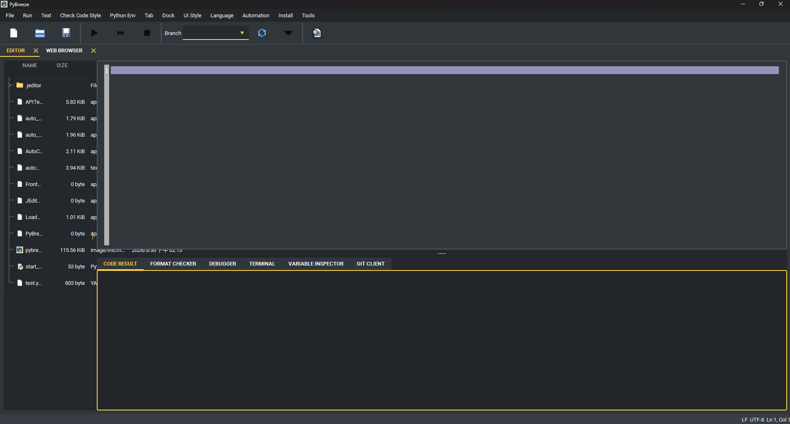

# PyBreeze：自動化優先的 IDE

[](https://www.python.org/downloads/)
[](../LICENSE)
[](https://doc.qt.io/qtforpython/)

[English](../README.md) | [简体中文](README_zh-CN.md)



**PyBreeze** 是一款專為自動化工程師打造的 Python IDE。它將 Web、API、GUI 和負載測試自動化整合到單一統一環境中——無需尋找插件、無需複雜的環境設定，開啟即可開始自動化。

---

## 目錄

- [功能特色](#功能特色)
  - [四維自動化](#四維自動化)
  - [IDE 核心功能](#ide-核心功能)
  - [內建工具](#內建工具)
  - [AI 輔助開發](#ai-輔助開發)
  - [插件系統](#插件系統)
  - [多語言介面](#多語言介面)
- [架構設計](#架構設計)
- [安裝方式](#安裝方式)
- [快速開始](#快速開始)
- [整合自動化模組](#整合自動化模組)
- [專案結構](#專案結構)
- [依賴項目](#依賴項目)
- [目標使用者](#目標使用者)
- [授權條款](#授權條款)

---

## 功能特色

### 四維自動化

PyBreeze 開箱即用，涵蓋自動化測試的完整範疇：

| 維度 | 模組 | 說明 |
|---|---|---|
| **Web 自動化** | [WebRunner](https://github.com/Intergration-Automation-Testing/WebRunner) | 瀏覽器互動模擬與測試，深度整合瀏覽器驅動與元素定位器 |
| **API 自動化** | [APITestka](https://github.com/Intergration-Automation-Testing/APITestka) | RESTful API 開發與測試，內建請求建構器、回應分析器、Mock 伺服器及斷言驗證 |
| **GUI 自動化** | [AutoControl](https://github.com/Intergration-Automation-Testing/AutoControl) | 桌面應用程式自動化，支援圖像辨識、座標定位、鍵盤滑鼠控制及動作錄製 |
| **負載與壓力測試** | [LoadDensity](https://github.com/Intergration-Automation-Testing/LoadDensity) | 高併發效能測試引擎，用於監控系統在極端壓力下的穩定性 |

此外還包含：

- **檔案自動化** — 透過 [automation-file](https://github.com/Intergration-Automation-Testing/AutomationFile) 模組實現自動化檔案與目錄操作
- **郵件自動化** — 透過 [MailThunder](https://github.com/Intergration-Automation-Testing/MailThunder) 實現自動化郵件寄送（例如測試報告傳遞）
- **測試框架** — 透過 [TestPioneer](https://github.com/Intergration-Automation-Testing/TestPioneer) 實現結構化 YAML 驅動的測試執行

### IDE 核心功能

PyBreeze 不僅僅是一個程式碼編輯器——它是自動化生命週期的指揮中心：

- **語法高亮** — 內建 Python 語法高亮，針對自動化函式庫（APITestka、AutoControl、WebRunner、LoadDensity 等）提供深度關鍵字識別。可透過插件新增自訂語法規則。
- **程式碼編輯器** — 基於 [JEditor](https://github.com/Intergration-Automation-Testing/JEditor) 構建，提供完整的編輯器功能，包含分頁管理、檔案樹瀏覽與專案工作區支援。
- **腳本執行** — 直接在 IDE 中執行自動化腳本，並即時顯示輸出。支援單一腳本與多腳本批次執行。
- **報告生成** — 自動化模組可在測試執行後生成 HTML、JSON 和 XML 報告，並支援可選的電子郵件傳遞。
- **整合 JupyterLab** — 在 PyBreeze 中直接以分頁方式啟動 JupyterLab，進行互動式筆記本開發。若未安裝 JupyterLab 將自動安裝。
- **虛擬環境感知** — 自動偵測並使用專案的虛擬環境（`.venv` 或 `venv`）。

### 內建工具

- **SSH 用戶端** — 完整的 SSH 終端用戶端，支援：
  - 密碼與私鑰驗證
  - 互動式指令執行
  - 遠端檔案樹檢視器，支援 CRUD 操作（建立資料夾、重新命名、刪除、上傳、下載）
- **套件管理器** — 直接從 IDE 選單安裝自動化模組和建構工具，無需離開編輯器。
- **整合文件** — 從選單列快速存取每個自動化模組的文件和 GitHub 頁面。

### AI 輔助開發

- **AI 程式碼審查** — 將程式碼傳送到 LLM API 端點進行自動化程式碼審查。可直接在 IDE 中接受或拒絕建議。
- **CoT（思維鏈）提示詞編輯器** — 建立和管理多步驟 CoT 提示詞，用於結構化程式碼分析，包含：
  - 程式碼審查提示詞
  - Code Smell 偵測
  - 程式碼檢查分析
  - 逐步分析
  - 摘要生成
- **Skill 提示詞編輯器** — 定義和管理可重複使用的技能型提示詞（程式碼解說、程式碼審查範本），可傳送至 LLM API。

### 插件系統

PyBreeze 支援可擴展的插件架構，用於：

- **語法高亮** — 透過插件為任何程式語言新增語法高亮
- **UI 翻譯** — 透過翻譯插件新增新的介面語言
- **執行設定** — 為編譯式和直譯式語言新增「以...執行」支援（C、C++、Go、Java、Rust 等）
- **插件瀏覽器** — 直接在 IDE 中從遠端儲存庫瀏覽並安裝插件

插件會從 `jeditor_plugins/` 目錄自動探索載入。完整文件請參閱 [PLUGIN_GUIDE.md](../PLUGIN_GUIDE.md)。

**內建插件：** C、C++、Go、Java、Rust 語法高亮與執行支援；法文翻譯。

### 多語言介面

IDE 介面支援多種語言：

- **English**（英文，預設）
- **繁體中文**
- 可透過插件新增其他語言

---

## 架構設計


PyBreeze 採用模組化架構：

```
PyBreeze UI (PySide6)
├── JEditor（基礎編輯器引擎）
│   ├── 程式碼編輯器與分頁
│   ├── 檔案樹瀏覽
│   ├── 語法高亮引擎
│   └── 插件系統
├── 自動化選單
│   ├── APITestka ──→ APITestka 執行器 ──→ je_api_testka
│   ├── AutoControl ──→ AutoControl 執行器 ──→ je_auto_control
│   ├── WebRunner ──→ WebRunner 執行器 ──→ je_web_runner
│   ├── LoadDensity ──→ LoadDensity 執行器 ──→ je_load_density
│   ├── FileAutomation ──→ FileAutomation 執行器 ──→ automation-file
│   ├── MailThunder ──→ MailThunder 執行器 ──→ je-mail-thunder
│   └── TestPioneer ──→ TestPioneer 執行器 ──→ test_pioneer
├── 工具
│   ├── SSH 用戶端（paramiko）
│   ├── AI 程式碼審查用戶端
│   ├── CoT 提示詞編輯器
│   ├── Skill 提示詞編輯器
│   └── JupyterLab 整合
└── 安裝選單
    ├── 自動化模組安裝器
    └── 建構工具安裝器
```

每個自動化模組都透過 `PythonTaskProcessManager` 在獨立的子行程中執行，提供行程隔離，防止崩潰影響 IDE。

---

## 安裝方式

### 從 PyPI 安裝

```bash
pip install pybreeze
```

### 從原始碼安裝

```bash
git clone https://github.com/Intergration-Automation-Testing/AutomationEditor.git
cd AutomationEditor
pip install -r requirements.txt
```

### 系統需求

- **Python**：3.10 或更高版本
- **作業系統**：Windows、macOS、Linux
- **GUI 框架**：PySide6 6.11.0（自動安裝）

---

## 快速開始

### 透過命令列執行

```bash
python -m pybreeze
```

### 透過 Python 腳本執行

```python
from pybreeze import start_editor

start_editor()
```

### 從 exe 目錄執行

```bash
python exe/start_pybreeze.py
```

啟動後，您可以：

1. **撰寫自動化腳本** — 在編輯器中享有語法感知的自動補全
2. **執行腳本** — 透過 `自動化` 選單，選擇目標模組（APITestka、WebRunner 等）
3. **檢視結果** — 在整合式輸出面板中查看
4. **生成報告** — 支援 HTML/JSON/XML 格式
5. **寄送報告** — 使用 MailThunder 整合功能透過電子郵件發送

---

## 整合自動化模組

### APITestka — API 測試

- HTTP 方法測試（GET、POST、PUT、DELETE 等）
- 透過 httpx 支援非同步 HTTP
- 使用 Flask 建立 Mock 伺服器
- 報告生成（HTML、JSON、XML）
- 基於排程器的事件觸發
- Socket 伺服器支援

### AutoControl — GUI 自動化

- 滑鼠控制（點擊、拖曳、滾動、位置追蹤）
- 鍵盤模擬（輸入、快捷鍵、按鍵按下/釋放）
- 圖像辨識與定位點擊
- 螢幕截圖
- 動作錄製與重播
- Shell 指令執行
- 行程管理

### WebRunner — Web 自動化

- 瀏覽器驅動整合
- 元素定位與互動
- 基於 Web 的測試腳本
- 報告生成

### LoadDensity — 負載測試

- 併發請求模擬
- 效能指標收集
- 壓力測試情境管理
- 報告生成

### MailThunder — 郵件自動化

- SMTP 郵件寄送
- HTML 報告傳遞
- 附件支援
- 基於環境變數的設定

### TestPioneer — 測試框架

- 基於 YAML 的測試定義
- 範本生成
- 結構化測試執行

### File Automation — 檔案自動化

- 自動化檔案與目錄操作
- 批次檔案處理

---

## 專案結構

```
PyBreeze/
├── pybreeze/
│   ├── __init__.py                 # 公開 API（start_editor、插件 re-export）
│   ├── __main__.py                 # 進入點（python -m pybreeze）
│   ├── extend/
│   │   ├── mail_thunder_extend/    # 測試後郵件報告寄送
│   │   ├── process_executor/       # 各自動化模組的子行程管理器
│   │   │   ├── api_testka/
│   │   │   ├── auto_control/
│   │   │   ├── file_automation/
│   │   │   ├── load_density/
│   │   │   ├── mail_thunder/
│   │   │   ├── test_pioneer/
│   │   │   └── web_runner/
│   │   └── process_executor/python_task_process_manager.py
│   ├── extend_multi_language/      # 內建翻譯（英文、繁體中文）
│   ├── pybreeze_ui/
│   │   ├── editor_main/            # 主視窗（擴展 JEditor）
│   │   ├── connect_gui/ssh/        # SSH 用戶端元件
│   │   ├── extend_ai_gui/          # AI 程式碼審查與提示詞編輯器
│   │   ├── jupyter_lab_gui/        # JupyterLab 整合
│   │   ├── menu/                   # 選單列建構
│   │   ├── syntax/                 # 自動化關鍵字定義
│   │   └── show_code_window/       # 程式碼顯示元件
│   └── utils/                      # 日誌、例外處理、檔案處理、套件管理
├── exe/                            # 獨立啟動器與建構設定
├── docs/                           # Sphinx 文件原始碼
├── test/                           # 單元測試
├── images/                         # 截圖
├── architecture_diagram/           # 架構圖
├── PLUGIN_GUIDE.md                 # 插件開發文件
├── pyproject.toml                  # 套件設定
├── requirements.txt                # 執行階段依賴項
└── dev_requirements.txt            # 開發依賴項
```

---

## 依賴項目

### 執行階段

| 套件 | 用途 |
|---|---|
| `PySide6` (6.11.0) | GUI 框架（Qt for Python）|
| `je-editor` | 基礎程式碼編輯器引擎 |
| `je_api_testka` | API 測試自動化 |
| `je_auto_control` | GUI/桌面自動化 |
| `je_web_runner` | Web 瀏覽器自動化 |
| `je_load_density` | 負載與壓力測試 |
| `je-mail-thunder` | 郵件自動化 |
| `automation-file` | 檔案操作自動化 |
| `test_pioneer` | 基於 YAML 的測試框架 |
| `paramiko` | SSH 用戶端支援 |
| `jupyterlab` | 整合式筆記本環境 |

### 開發

`build`、`twine`、`sphinx`、`sphinx-rtd-theme`、`auto-py-to-exe`

---

## 目標使用者

- **Python 開發者** — 一個輕量、專用的環境，用於構建自動化腳本，無需承受重量級通用 IDE 的負擔
- **SDET（測試開發工程師）** — 需要在同一工具中同時維護 Web、API 和效能測試的專業人士
- **自動化初學者** — 一個友善的 IDE，透過零設定環境降低 Python 自動化的入門門檻
- **DevOps 團隊** — 一個在 CI/CD 流水線中快速構建和除錯整合測試套件的平台

---

## 授權條款

本專案採用 MIT 授權條款——詳情請參閱 [LICENSE](../LICENSE) 檔案。

Copyright (c) 2022 JE-Chen
