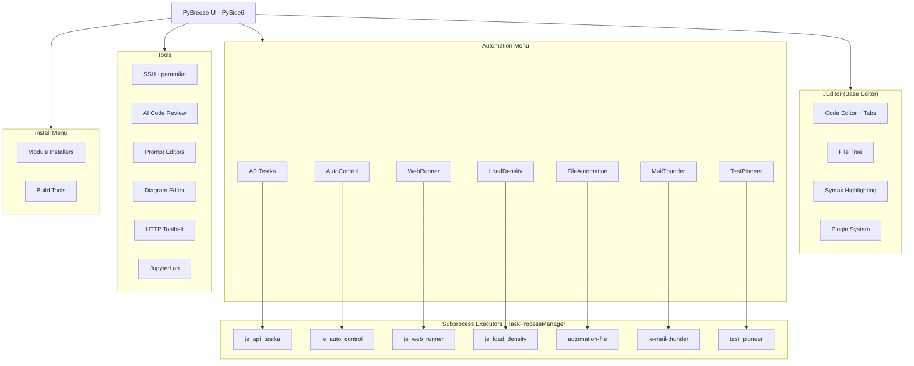

# PyBreeze：自動化優先的 IDE

[](https://www.python.org/downloads/)
[](../LICENSE)
[](https://doc.qt.io/qtforpython/)
[](https://pybreeze.readthedocs.io/en/latest/index.html)

[English](../README.md) | [简体中文](README_zh-CN.md)

**PyBreeze** 是一款專為自動化工程師打造的 Python IDE。Web、API、GUI 與負載測試都在同一個視窗裡，旁邊還有自動化工作實際需要的日常 HTTP 工具——不必四處找外掛，也不必挖掘環境設定。


*主視窗：編輯器開著一個 APITestka 動作檔，左側是專案樹，下方是執行／格式檢查／除錯／終端機面板。*

---

## 目錄

- [截圖導覽](#截圖導覽)
- [四維自動化](#四維自動化)
- [內建工具](#內建工具)
- [AI 輔助開發](#ai-輔助開發)
- [外掛系統](#外掛系統)
- [多語言介面](#多語言介面)
- [架構](#架構)
- [安裝](#安裝)
- [快速開始](#快速開始)
- [整合的自動化模組](#整合的自動化模組)
- [專案結構](#專案結構)
- [相依套件](#相依套件)
- [測試與 CI](#測試與-ci)
- [目標使用者](#目標使用者)
- [授權條款](#授權條款)

---

## 截圖導覽

IDE 的大部分功能集中在三個選單（繁體中文介面顯示為括號內的名稱）。**Automation**（自動化）執行你的腳本，**Tools**（工具）開啟各種工具分頁，**Install**（安裝）下載安裝各個模組。

| Automation | Tools | Install |
|---|---|---|
|  |  |  |

每次自動化執行都在獨立的子行程中進行。輸出會即時傳回執行視窗，編輯器同時保持可操作——stdout 以一般顏色顯示，stderr 以紅色顯示，最後附上行程的結束代碼：


*一次實際的執行：透過 IDE 的檔案執行器呼叫 PyBreeze 自己的 curl 解析器，產生一支 pytest 測試。*

---

## 四維自動化

PyBreeze 開箱即用，涵蓋自動化測試的完整範疇：

| 維度 | 模組 | 功能 |
|---|---|---|
| **API** | [APITestka](https://github.com/Integration-Automation/APITestka) | RESTful 測試，內建請求建構器、回應分析器、Mock 伺服器與斷言 |
| **Web** | [WebRunner](https://github.com/Integration-Automation/WebRunner) | 以瀏覽器驅動的互動與測試，整合驅動程式與元素定位器 |
| **GUI** | [AutoControl](https://github.com/Integration-Automation/AutoControlGUI) | 桌面自動化，支援圖像辨識、座標、鍵盤／滑鼠控制與錄製 |
| **Load** | [LoadDensity](https://github.com/Integration-Automation/LoadDensity) | 高併發效能測試，檢驗系統在壓力下的穩定性 |

此外還有：

- **檔案自動化** — 透過 [automation-file](https://github.com/Integration-Automation/FileAutomation) 進行檔案與目錄操作
- **郵件自動化** — 透過 [MailThunder](https://github.com/Integration-Automation/MailThunder) 寄送報告
- **測試框架** — 透過 [TestPioneer](https://github.com/Integration-Automation/TestPioneer) 以 YAML 驅動執行

每個模組的選單結構都一樣：**Run**（單一腳本、整個目錄批次執行，可選擇是否寄出報告郵件）、**Help**（文件與 GitHub 頁面以 IDE 內的瀏覽器分頁開啟）、**Project**（建立範本目錄），以及在有提供時的原生 GUI 分頁。

### IDE 核心

- **自動化關鍵字集** — 在 JEditor 的語言支援之上，`AT_*`／GUI／Web／Load 關鍵字集註冊給 `.json`，TestPioneer 的結構描述註冊給 `.yml` 與 `.yaml`。JEditor 目前還不會為它們上色：它用自己針對這些副檔名的規則高亮，不會用到註冊的關鍵字
- **程式碼編輯器** — 以 [JEditor](https://github.com/Integration-Automation/JEDITOR) 為基礎：分頁、專案樹、格式檢查、除錯器、終端機與 git 用戶端面板
- **腳本執行** — 單一或批次執行，每次執行都有自己的視窗與 Stop 按鈕（Run ▸ Stop All Program 會全部停止）；動作檔以路徑傳入，而目前分頁中的腳本若超過 Windows 命令列長度上限（約 32 KB），會改用暫存檔傳遞
- **報告產生** — 執行後產生 HTML／JSON／XML 報告，並可選擇以電子郵件寄送
- **整合 JupyterLab** — 以分頁方式啟動，使用與執行腳本相同的直譯器；那裡沒有 JupyterLab 時會自動安裝
- **虛擬環境感知** — 執行時使用在 **Python Env** 選擇的直譯器；沒有選擇時，自動偵測並使用工作資料夾中的 `venv/` 或 `.venv/`，都沒有時則以 IDE 本身使用的直譯器執行

---

## 內建工具

只有一個主要按鈕的工具，在工具裡任何地方按 Ctrl+Enter 就等於按下那顆按鈕：文字框裡的 Enter 是換行。Query ↔ JSON 與 URL 解析／組建器可以雙向轉換，Ctrl+Enter 會依輸入決定方向：輸入是 JSON 物件時從 JSON 轉出。

### cURL 匯入 — 複製下來的請求變成可執行的腳本

從瀏覽器開發者工具貼上一段 `curl` 指令，再選擇輸出目標。解析器能處理方法、URL、標頭、本文、Basic 驗證、`-G` 查詢參數、`-F` multipart 欄位（上傳檔案會變成 `files=open(...)`）、`--json` 簡寫、`-d @file` 本文，以及多行接續。重複的 `-H` 值會照 HTTP 的方式合併（cookie 用 `; `，其他用 `, `），而不是默默只留下最後一個。過程中不會執行任何東西——純粹是解析。

| 目標：pytest | 目標：APITestka JSON 動作 |
|---|---|
|  |  |

輸出目標：Python `requests`、可直接執行的 **pytest** 測試、**APITestka**（Python，或可由 `execute_files` 直接執行的 `[["AT_test_api_method", {...}]]` 動作清單），以及 **LoadDensity** 的 Locust 負載測試。輸出可以複製、直接開到編輯器分頁，或以正確的副檔名儲存。只要按一下，也能把解析出的 URL 交給 URL 解析／建構器，或把標頭交給標頭分析器。

### HAR 匯入 — 整段工作階段變成測試套件

「Copy as cURL」只抓一個請求；**Save all as HAR** 則抓下整段工作階段。開啟匯出檔後，每個記錄下來的呼叫都會列出方法、路徑、狀態碼與媒體類型，頁面裝飾類資源（CSS、圖片、字型）預設會被濾掉。


選擇需要的項目——或直接取用全部列出的項目——就能用與 cURL 匯入相同的輸出目標產生一支腳本。重複的端點會得到編號過的測試名稱，不會有測試默默蓋掉另一個；HTTP/2 虛擬標頭會被移除，與記錄中 cookie 清單重複的 `Cookie` 標頭也會拿掉，讓每個值只送出一次（同名的 cookie 無法放進字典，改以標頭送出）。無法變成請求的項目，例如 URL 或方法格式錯誤的項目，會被略過，其餘照常載入。只選一個請求時，產生的結果與 cURL 匯入完全相同。HAR 是 JSON，因此只需要標準函式庫，而且不會替你重播任何請求。

### Response Inspector — 貼上回應，讀出裡面的一切


狀態碼會到 HTTP 參考表中查詢，標頭會被解析，JSON 本文會格式化顯示，文字中任何位置的 JWT（例如 `Authorization: Bearer` 標頭）都會被解碼，時間戳記類的宣告以 UTC 顯示。每項發現都能在對應的工具分頁中開啟，並預先填好內容。

### HTTP 標頭分析器 — 一段標頭實際在說什麼


會回報：送出不只一次的名稱、缺少 `Secure`／`HttpOnly`／`SameSite` 的 `Set-Cookie` 項目、萬用字元 CORS（以及瀏覽器會直接拒絕的「萬用字元加憑證」組合）、短到撐不過重新啟動的 HSTS `max-age`、CSP 的 `unsafe-inline`／`unsafe-eval`、產品版本標語、已淘汰的標頭，以及——針對回應——缺少的安全標頭。攜帶憑證的標頭**只回報名稱**；它們的值絕不會進入報告。

### 文字比對


比較兩段內容——例如預期與實際的 API 回應——得到 unified diff（新增與刪除的行以主題的顏色標示），以及一行新增／刪除摘要。

### 日常小工具

每個都是分頁或停駐面板，底部都有同樣的一排：複製／在編輯器開啟／儲存成檔案。


- **JWT 解碼器** — 標頭與酬載以格式化的 JSON 顯示，`exp`／`iat`／`nbf`／`auth_time` 轉成易讀的 UTC。只做檢視：絕不驗證簽章，也絕不信任權杖。
- **正規表示式測試器** — 支援 `IGNORECASE`／`MULTILINE`／`DOTALL`／`VERBOSE`，列出每個比對結果的位移、編號群組與具名群組。在樣式欄按 Enter 即執行。無效的樣式會顯示友善的錯誤訊息，不會當掉。
- **HTTP 狀態碼參考** — 以代碼前綴或關鍵字搜尋完整的狀態碼表（資料來自標準函式庫，因此會保持最新）。
- **JSON 格式化** — 格式化或壓縮，輸入不是 JSON 時會給出清楚的驗證錯誤。


- **時間戳記轉換器** — 輸入 Unix epoch（秒、毫秒、微秒或奈秒，自動判斷）或 ISO-8601 日期時間（可帶 `Z`、`+08`、`+0800` 或 `+08:00`，小數位數不限，基本或延伸格式皆可），輸出所有 UTC 表示法。結果固定，不受本機時區影響。
- **雜湊產生器** — 同時計算 SHA-256、SHA-512、SHA-1 與 MD5（MD5／SHA-1 以 `usedforsecurity=False` 提供互通用途，絕不用於安全判斷）。
- **Query ⇄ JSON** — `application/x-www-form-urlencoded` 轉成格式化的 JSON，也能轉回來；重複的鍵會變成陣列，反之亦然。
- **URL 解析器／建構器** — 把 scheme、主機、連接埠、路徑、查詢、片段與憑證拆成可編輯的 JSON 物件，也能組回 URL。會自動為 IPv6 位址加上方括號，並重新編碼查詢參數。

### 圖表編輯器 — 不離開 IDE 就能畫架構圖


*把 Mermaid `flowchart` 貼進匯入器後自動排版的結果。*

以 `QGraphicsScene` 打造的所見即所得編輯器：矩形、圓角矩形、橢圓與菱形節點，可加上連線標籤的貝茲曲線連線，還有自由文字與圖片。Mermaid `flowchart`／`graph` 匯入會執行 Sugiyama 式排版（分層、減少交叉、跨軸對齊）。可儲存與開啟 `.diagram.json`，匯出為 PNG 或 SVG，並支援復原／重做、對齊、均分、格線、貼齊與縮放。從 URL 下載的圖片會經過 SSRF 驗證並有大小上限。

### SSH 用戶端 — 終端機與遠端檔案樹並排


支援密碼或私鑰驗證（金鑰檔以 Browse 挑選，從 `~/.ssh` 開始：OpenSSH 或 PEM 格式的 RSA、Ed25519、ECDSA 金鑰，PKCS#8 也可以；PuTTY 的 `.ppk` 金鑰要先在 PuTTYgen 匯出成 OpenSSH 金鑰，錯誤訊息會說明怎麼做；勾選金鑰驗證時，密碼欄會改成「密語」，填入私鑰的密語），具備 keepalive、會顯示 ANSI 顏色的互動式 shell，以等寬字型顯示，視窗大小改變時會把新的寬度與高度告訴 shell（上下方向鍵叫回先前送出的指令，空白的一行按 Enter 也會送到 shell，`clear` 與 `reset` 會清空畫面，**Interrupt**（中斷）按鈕、或在沒有選取文字的指令列按 Ctrl+C，可停止 shell 中正在執行的程式；畫面是一行一行顯示輸出，所以 `vim`、`htop` 這類移動游標畫滿整個畫面的程式會顯示錯亂），以及延遲載入的 SFTP 檔案樹，可建立資料夾／重新命名／刪除／上傳／下載（和專案檔案樹一樣，F2 重新命名、Delete 刪除目前的項目）。每個 SFTP 請求都在背景執行，連線卡住也不會讓 IDE 凍結。上傳時若要取代伺服器上的檔案會先詢問，傳輸也能從檔案樹的選單取消。上下傳都會先寫入暫存檔，所以連線中斷時舊的檔案仍完整無缺。未知的主機金鑰**不會**自動接受：第一次連線時會顯示 SHA256 指紋供確認（首次使用即信任），並保存到 `~/.pybreeze/ssh_known_hosts`；`~/.ssh/known_hosts` 裡的主機也同樣信任。信任過的主機若換成另一把金鑰，會直接拒絕、不再詢問，並列出兩個 SHA256 指紋，以及金鑰是刻意更換時要從哪個檔案刪掉它那一行。

### 其他

- **檔案樹右鍵選單** — 按右鍵即可建立、重新命名、刪除、複製絕對或相對路徑，或在系統的檔案管理員中顯示該項目（在 Explorer 與 Finder 中會選取該檔案）。焦點在檔案樹時，F2 重新命名、Delete 刪除目前的項目。刪除前會先詢問，預設是「否」，刪除的項目會移到回收筒（Windows 的資源回收筒）；沒有回收筒的地方（例如某些網路磁碟），會再問一次才永久刪除。重新命名或刪除已在編輯器分頁中開啟的檔案時，分頁會同步更新。
- **套件管理員** — 從選單安裝自動化模組與建置工具，輸出顯示在執行視窗中。
- **整合文件** — 每個模組的文件與 GitHub 頁面都以 IDE 內的瀏覽器分頁開啟（TestPioneer 的文件就是它 GitHub 上的 README）。

---

## AI 輔助開發

和工具一樣，在 AI 程式碼審查、CoT 程式碼審查或 Skill Send 裡按 Ctrl+Enter，就等於按下送出鈕。

### AI 程式碼審查


*畫面為送出前的狀態。* 把選取的程式碼送到 LLM 端點（以 POST（預設）或 PUT 送出，程式碼放在本文的表單欄位 `code`；GET 與 DELETE 只送出 URL），再接受或拒絕建議——統計會記錄在 `~/.pybreeze/response_stats.txt`。URL 會經過 SSRF 驗證，連線只會連到檢查過的位址，不跟隨重新導向，回應本文在送進面板前也有大小上限。因此本機或私有網路上的端點（例如在本機跑的模型伺服器）會被拒絕；CoT Code Review 與 Skill Send 也用同樣的方式檢查端點 URL。

### 思維鏈程式碼審查（prthinker）

對正在編輯的檔案或一個 Pull Request 執行 [prthinker](https://github.com/JE-Chen/Code-Review-Framework-Combining-Large-Language-Models-and-Chain-of-Thought-Reasoning) 審查流程，輸出即時傳進執行視窗。


一張設定表就包含推論後端（`remote`、`local`、OpenAI 相容、Anthropic、Gemini、Cohere、Mistral、`claude-cli`、`codex-cli`）、程式碼託管平台（GitHub／GitLab／Gitea）與儲存庫。**金鑰與權杖以環境變數交給審查，絕不放在命令列上**——那裡會被行程清單看到——而且在日誌中會被遮蔽。模型名稱會交給所選的後端。規則檢索（RAG）預設為 `off`，設為 `remote` 時會向 prthinker 伺服器的 `/rag` 查詢：prthinker 的本機規則索引隨它的儲存庫提供，不在由它安裝的套件裡。審查以 `Python Env` 選定的直譯器執行，因此 PyBreeze 本身可以停留在比 prthinker 所需的 3.12 更舊的 Python 上。

### CoT 提示詞編輯器


建立與管理多步驟的審查鏈：初次摘要 → 初次程式碼審查 → 評審該次審查 → linter → 程式碼異味偵測 → 逐步分析 → 總結 → 評審總結。每一步都會引用它所需的前面步驟的答案。檔案受到監看，所以外部的修改會立即反映出來。

從 **Tools → AI → CoT Code Review** 執行這條審查鏈（以分頁開啟，或從 Dock 選單以停駐面板開啟）：貼上程式碼、填入端點 URL，每一步的答案一到就會出現在選擇器中。每一步都以 POST 送出 JSON `{"prompt": "..."}`，回應本文（以文字讀取）就是那一步的答案。

### Skill 提示詞編輯器與 Skill Send

| Skill 提示詞編輯器 | Skill Send |
|---|---|
|  |  |

定義可重複使用的 skill 提示詞（程式碼解說、程式碼審查），再從專用的分頁或停駐面板選一個、視需要編輯，然後送到 LLM 端點：以 POST 送出裝著提示詞的 JSON `{"code": "..."}`，回應本文照原樣顯示。*兩者都是送出前的狀態——拍攝這些截圖時沒有連線到任何端點。*

---

## 外掛系統

PyBreeze 沿用 JEditor 的外掛架構，會自動從工作目錄中的 `jeditor_plugins/` 目錄探索外掛。外掛可以註冊：

- **語法高亮** — JEditor 自己不上色的副檔名的關鍵字集與規則（`.c`、`.cpp`、`.go`、`.java`、`.js`、`.json`、`.rs`、`.sh`、`.sql`、`.toml`、`.ts`、`.yaml` 等 JEditor 會上色的副檔名，用的是它自己的規則）
- **介面翻譯** — 新的介面語言
- **執行設定** — 為直譯式（`go run main.go`）與編譯式（`gcc main.c -o main` 後執行）語言提供「Run with…」，透過 PyBreeze 的 `FileRunnerProcess` 執行，並在結束後清掉編譯產物
- **外掛瀏覽器** — 在 IDE 內瀏覽並安裝遠端儲存庫中的外掛，入口是 **Plugins → Plugin Browser**，還沒裝任何外掛時也在；裝好的外掛在下次啟動時載入

已載入的外掛會出現在它們專屬的 **Plugins**（外掛）選單下，附一個 About 項目和一個執行動作，動作名稱標示它能執行的副檔名。[PLUGIN_GUIDE.md](../PLUGIN_GUIDE.md) 說明 PyBreeze 額外提供的部分，並連到 JEditor 的指南，那裡有完整的 API 與實作範例（C、C++、Go、Java、Rust，以及法文翻譯）。

---

## 多語言介面

- **English**（英文，預設）
- **繁體中文**（Traditional Chinese）

選單、對話框、工具拒絕輸入時說明的原因，以及執行視窗自己的訊息（`[錯誤] …`、`[執行] …`）都會跟著所選的語言顯示。兩份字典都有相同的 760 個鍵，並有測試強制兩者一致，因此新字串不可能只出現在其中一種語言。語言選單另外列出 JEditor 的日文與簡體中文：選了之後 JEditor 自己的選單會改變，PyBreeze 的字串則維持英文。其他語言可透過翻譯外掛加入。

---

## 架構


```mermaid
flowchart TB
    UI["PyBreeze UI · PySide6"]

    subgraph Editor["JEditor (Base Editor)"]
        direction LR
        E1["Code Editor + Tabs"]
        E2["File Tree"]
        E3["Syntax Highlighting"]
        E4["Plugin System"]
    end

    subgraph Automation["Automation Menu"]
        direction LR
        A1["APITestka"]
        A2["AutoControl"]
        A3["WebRunner"]
        A4["LoadDensity"]
        A5["FileAutomation"]
        A6["MailThunder"]
        A7["TestPioneer"]
    end

    subgraph Executors["Subprocess Executors · TaskProcessManager"]
        direction LR
        X1["je_api_testka"]
        X2["je_auto_control"]
        X3["je_web_runner"]
        X4["je_load_density"]
        X5["automation-file"]
        X6["je-mail-thunder"]
        X7["test_pioneer"]
    end

    subgraph Tools["Tools"]
        direction LR
        T1["SSH · paramiko"]
        T2["AI Code Review"]
        T3["Prompt Editors"]
        T4["Diagram Editor"]
        T5["HTTP Toolbelt"]
        T6["JupyterLab"]
    end

    subgraph Install["Install Menu"]
        direction LR
        I1["Module Installers"]
        I2["Build Tools"]
    end

    UI --> Editor
    UI --> Automation
    UI --> Tools
    UI --> Install

    A1 --> X1
    A2 --> X2
    A3 --> X3
    A4 --> X4
    A5 --> X5
    A6 --> X6
    A7 --> X7
```

**編輯器行程從不執行你的腳本。** 每個自動化模組都以 `python -m <package>` 在專案的直譯器中啟動，並使用 `shell=False`。兩條常駐執行緒把 stdout 與 stderr 讀進執行緒安全的佇列；一個 100 ms 的 `QTimer` 以有上限的批次把它們取出，送到 UI 執行緒。腳本當掉、卡住或陷入無限輸出迴圈，都不會連帶拖垮 IDE。

逐一介紹各模組的程式碼導覽，請參閱 [architecture_explore.md](../architecture_explore.md)。

---

## 安裝

### 從 PyPI 安裝

```bash
pip install pybreeze
```

### 從原始碼安裝

```bash
git clone https://github.com/Integration-Automation/PyBreeze.git
cd PyBreeze
pip install -r requirements.txt
```

### 系統需求

- **Python**：3.10 – 3.14
- **作業系統**：Windows、macOS、Linux
- **GUI**：PySide6 6.11.2（自動安裝）

---

## 快速開始

```bash
python -m pybreeze                # 命令列
python exe/start_pybreeze.py      # 從 exe 目錄
```

```python
from pybreeze import start_editor

start_editor()                              # 從 UI Style 選的主題（還沒選過時是 dark_amber）
start_editor(theme="dark_teal.xml")         # 任何 qt_material 主題；它會成為選定的主題
```

啟動後：

1. **撰寫** — 在編輯器中撰寫自動化腳本
2. **執行** — 從 `Automation` 選單執行，選擇目標模組
3. **觀看** — 輸出即時傳進執行視窗
4. **產生** — HTML／JSON／XML 報告
5. **寄送** — 透過 MailThunder 整合以電子郵件寄出

### 日誌檔

PyBreeze 的日誌寫在 `~/.pybreeze/logs/PyBreeze.log`：UTF-8，每次執行都接在後面，每行帶著行程編號。只有警告與錯誤也會出現在編輯器的 Code Result 面板。兩個環境變數可以改變這些：

| 變數 | 作用 |
|---|---|
| `PYBREEZE_LOG_FILE` | 改寫到這個檔案 |
| `PYBREEZE_LOG_MAX_BYTES` | PyBreeze 行程第一次寫日誌時，檔案若大於這個位元組數，先改名為原檔名加上 `.1`，取代上一份（預設 104857600，即 100 MB；`0` 表示不改名） |

---

## 整合的自動化模組

| 模組 | 功能 |
|---|---|
| **APITestka** | HTTP 方法、透過 httpx 的非同步請求、Flask Mock 伺服器、HTML/JSON/XML 報告、排程觸發、socket 伺服器、JSON-schema 與 JSONPath 斷言、SLA 檢查、錄製重播 cassette |
| **AutoControl** | 滑鼠（點擊、拖曳、捲動、位置）、鍵盤（輸入、快捷鍵、按下／放開）、圖像辨識與定位點擊、螢幕截圖、錄製與播放、shell 與行程控制 |
| **WebRunner** | 瀏覽器驅動程式整合、元素定位與互動、Web 測試腳本、報告 |
| **LoadDensity** | 併發請求模擬、效能指標、壓力情境管理、報告 |
| **MailThunder** | SMTP 寄信、HTML 報告寄送、附件、以環境變數設定 |
| **TestPioneer** | YAML 測試定義、範本產生、結構化執行；`Install ▸ Automation ▸ Install TestPioneer` 可安裝或升級（0.1.34 起不論系統語系，都以 UTF-8 讀取 YAML 檔） |
| **File Automation** | 自動化檔案與目錄操作、批次處理 |
| **prthinker** | 對檔案或 Pull Request 進行思維鏈程式碼審查；設定存於 `~/.pybreeze/prthinker_setting.json`；透過 `Install ▸ Automation ▸ Install prthinker` 從它自己的原始碼資料夾安裝（需要 Python 3.12 以上） |

---

## 專案結構

```
PyBreeze/
├── pybreeze/
│   ├── __init__.py                    # 公開 API（start_editor、外掛 re-export）
│   ├── __main__.py                    # 進入點（python -m pybreeze）
│   ├── extend/
│   │   ├── process_executor/          # 子行程隔離層
│   │   │   ├── python_task_process_manager.py   # TaskProcessManager（核心）
│   │   │   ├── process_executor_utils.py        # build_process / start_process
│   │   │   ├── file_runner_process.py           # 外掛執行設定（任何語言）
│   │   │   ├── queue_pump.py                    # 共用的管線讀取器 + QTimer 取出
│   │   │   ├── test_pioneer/ prthinker/
│   │   ├── mail_thunder_extend/       # 測試後郵件報告掛鉤
│   │   └── prthinker_extend/          # prthinker 設定與參數組裝
│   ├── extend_multi_language/         # 內建多語言（英文、繁體中文）
│   ├── pybreeze_ui/
│   │   ├── editor_main/               # 主視窗 + 檔案樹右鍵選單
│   │   ├── menu/                      # Automation / Install / Tools / 外掛選單
│   │   ├── tools_gui/                 # cURL、HAR、JWT、diff、regex 等工具分頁
│   │   ├── diagram_editor/            # 所見即所得圖表編輯器
│   │   ├── extend_ai_gui/             # CoT 審查、提示詞編輯器、skill send
│   │   ├── connect_gui/               # SSH 終端機 + SFTP 檔案樹、AI 審查用戶端
│   │   ├── jupyter_lab_gui/           # JupyterLab 分頁
│   │   ├── show_code_window/          # CodeWindow（執行輸出）
│   │   ├── dialog/                    # prthinker 設定對話框
│   │   └── syntax/                    # 自動化關鍵字定義
│   └── utils/                         # curl/HAR 解析、標頭、JWT、雜湊、
│                                      # URL 驗證、日誌、例外……
├── exe/                               # 獨立啟動器與建置設定
├── docs/                              # Sphinx 文件原始碼；updates/ 是更新紀錄
├── test/                              # 單元測試（test_utils）+ 啟動測試
├── images/                            # 截圖
├── architecture.md                    # 架構總覽：分層、主要流程、跨專案約定
├── architecture_explore.md            # 逐模組的架構筆記
├── progress.md                        # 尚未完成的工作
├── PLUGIN_GUIDE.md                    # 外掛開發文件
├── pyproject.toml                     # 套件設定（穩定版）
├── dev.toml                           # 套件設定（開發通道）
└── requirements.txt                   # 執行階段相依套件
```

---

## 相依套件

### 執行階段

| 套件 | 用途 |
|---|---|
| `PySide6` (6.11.2) | GUI 框架（Qt for Python） |
| `je-editor` | 基礎程式碼編輯器引擎 |
| `je_api_testka` | API 測試自動化 |
| `je_auto_control` | GUI／桌面自動化 |
| `je_web_runner` | Web 瀏覽器自動化 |
| `je_load_density` | 負載與壓力測試 |
| `je-mail-thunder` | 郵件自動化 |
| `automation-file` | 檔案操作自動化 |
| `test_pioneer` | 以 YAML 為基礎的測試框架 |
| `paramiko` | SSH 用戶端支援 |
| `jupyterlab` | 整合的筆記本環境 |

### 開發

`build`、`twine`、`sphinx`、`sphinx-rtd-theme`、`auto-py-to-exe`、`pytest`、`pytest-cov`、`hypothesis`、`ruff`

---

## 測試與 CI

```bash
python -m pip install -r dev_requirements.txt
python -m pytest test/test_utils/ -v --tb=short
```

- **單元測試** — `test/test_utils/`，涵蓋純邏輯層（curl 與 HAR 解析、標頭分析、SSRF 驗證、JWT、雜湊、時間戳記、比對），加上透過 `QT_QPA_PLATFORM=offscreen` 的無視窗 Qt 元件測試，以及針對各解析器的 Hypothesis 性質測試。SSH 終端機與 SFTP 檔案樹另外會實際登入測試在本機回環位址啟動的 SSH 伺服器，它以 SFTP 提供一個暫存資料夾
- **啟動測試** — `test/unit_test/start_automation/` 以 debug 模式啟動 IDE，確認它能正常開啟並乾淨地結束
- **CI** — 在 Windows 上以 GitHub Actions 跑 Python 3.10 – 3.14，每次 push 與 PR 都會執行，另外每晚執行一次
- **靜態分析** — SonarCloud、Codacy 與 Bandit

---

## 目標使用者

- **Python 開發者** — 一個輕量、專用的自動化腳本環境，沒有通用 IDE 的額外負擔
- **SDET（測試開發工程師）** — 用同一個工具並行維護 Web、API 與效能測試
- **自動化初學者** — 零設定的環境建置，每個模組都有選單
- **DevOps 團隊** — 建置與除錯要送進 CI/CD 的整合測試套件的地方

---

## 授權條款

MIT — 請參閱 [LICENSE](../LICENSE)。Copyright (c) 2022 JE-Chen

---

<sub>截圖是在 Windows 11 上以預設的 `dark_amber` 主題，從實際的 PyBreeze 元件渲染而來；每個工具中的範例資料都是由實際程式路徑處理過的真實輸入。</sub>
